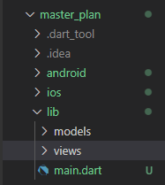
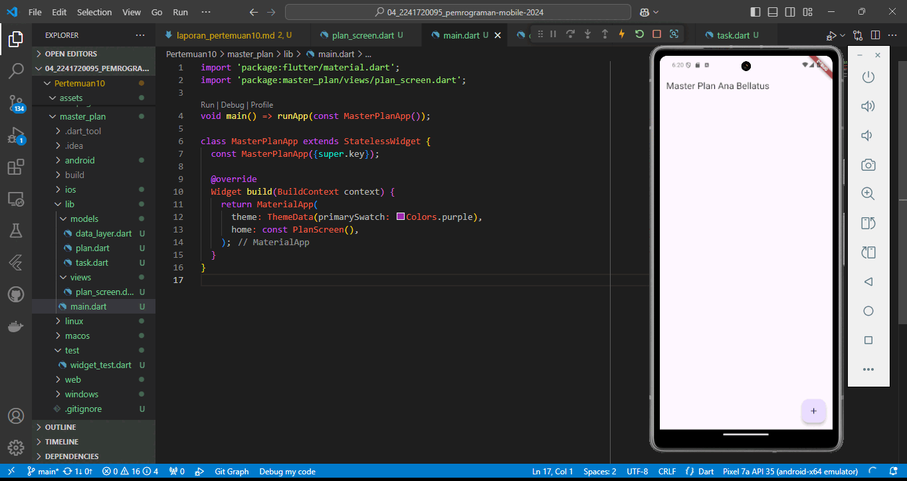
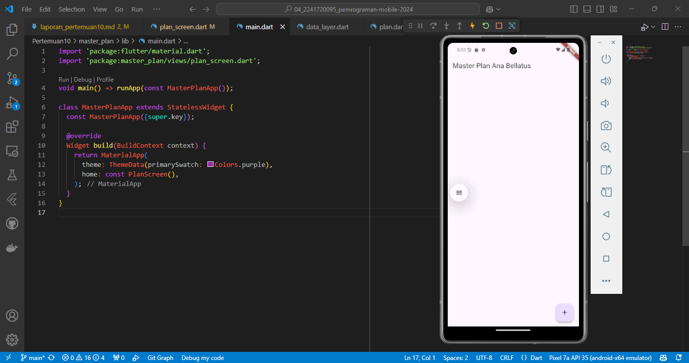
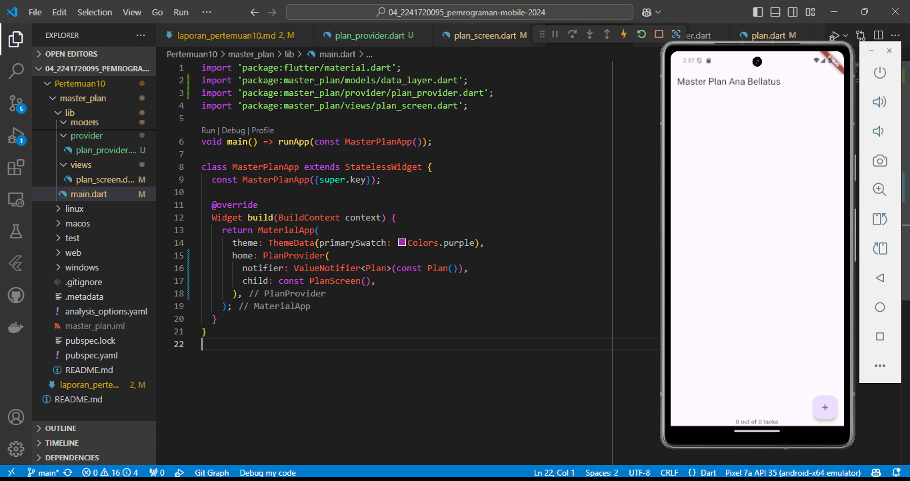
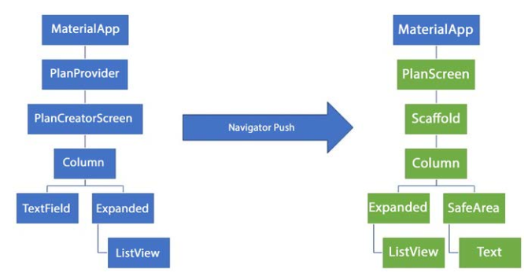
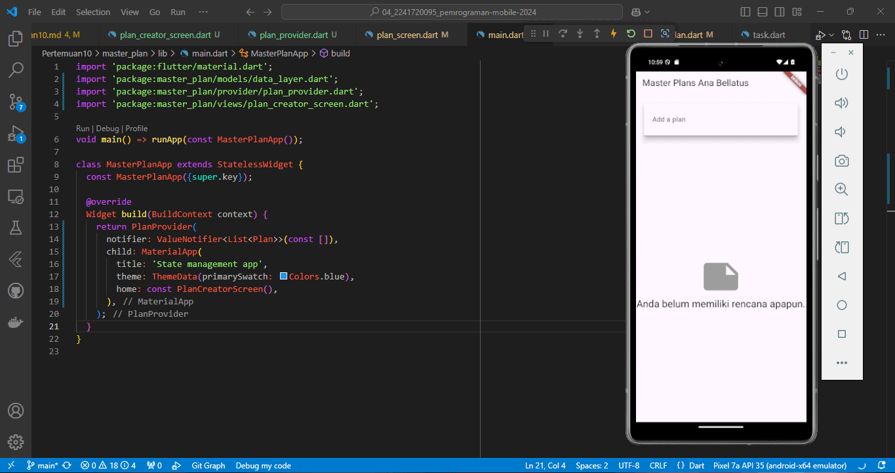

# Modul 10

---

#### NIM : 2241720095

#### Nama   : Ana Bellatus Mustaqfiro

#### Kelas   : D4 TI - 3F

#### No. Urut  : 04

#### Mata Kuliah  : Pemrograman Mobile (10 | Dasar State Management)

---

## Praktikum 1 - Dasar State dengan Model-View

**Langkah 1 - Buat project baru**


**Langkah 2 - Membuat model task.dart**
**models/task.dart**

```dart
class Task {
  final String description;
  final bool complete;

  const Task({
    this.complete = false,
    this.description = '',
  });
}
```

**Langkah 3 - Buat file plan.dart**
**models/plan.dart**

```dart
import './task.dart';

class Plan {
  final String name;
  final List<Task> tasks;

  const Plan({
    this.name = '',
    this.tasks = const [],
  });
}
```

**Langkah 4 - Buat file data_layer.dart**
**models/data_layer.dart**

```dart
export 'plan.dart';
export 'task.dart';
```

**Langkah 5 - Pindah ke file main.dart**
**main.dart**

```dart
import 'package:flutter/material.dart';

void main() => runApp(const MasterPlanApp());

class MasterPlanApp extends StatelessWidget {
  const MasterPlanApp({super.key});

  @override
  Widget build(BuildContext context) {
    return MaterialApp(
      theme: ThemeData(primarySwatch: Colors.purple),
      home: PlanScreen(),
    );
  }
}
```

**Langkah 6 - buat plan_screen.dart**
**plan_screen.dart**

```dart
class PlanScreen extends StatefulWidget {
  const PlanScreen({super.key});

  @override
  State<StatefulWidget> createState() => _PlanScreenState();
}

class _PlanScreenState extends State<PlanScreen> {
  Plan plan = const Plan();

  @override
  Widget build(BuildContext context) {
    return Scaffold(
      appBar: AppBar(
        title: const Text('Master Plan Ana Bellatus'),
      ),
      body: _buildList(),
      floatingActionButton: _buildAddTaskButton(),
    );
  }
}
```

**Langkah 7 - buat method _buildAddTaskButton()**
**plan_screen.dart**

```dart
Widget _buildAddTaskButton() {
    return FloatingActionButton(
      child: const Icon(Icons.add),
      onPressed: () {
        setState(() {
          plan = Plan(
            name: plan.name,
            tasks: List<Task>.from(plan.tasks)..add(const Task()),
          );
        });
      },
    );
  }
```

**Langkah 8 - buat widget _buildList()**
**plan_screen.dart**

```dart
Widget _buildList() {
    return ListView.builder(
      itemCount: plan.tasks.length,
      itemBuilder: (context, index) => _buildTaskTile(plan.tasks[index], index),
    );
  }
```

**Langkah 9 - buat widget _buildTaskTile**
**plan_screen.dart**

```dart
Widget _buildTaskTile(Task task, int index) {
    return ListTile(
      leading: Checkbox(
          value: task.complete,
          onChanged: (selected) {
            setState(() {
              plan = Plan(
                name: plan.name,
                tasks: List<Task>.from(plan.tasks)
                  ..[index] = Task(
                    description: task.description,
                    complete: selected ?? false,
                  ),
              );
            });
          }),
      title: TextFormField(
        initialValue: task.description,
        onChanged: (text) {
          setState(() {
            plan = Plan(
              name: plan.name,
              tasks: List<Task>.from(plan.tasks)
                ..[index] = Task(
                  description: text,
                  complete: task.complete,
                ),
            );
          });
        },
      ),
    );
  }
```

Run atau tekan F5 untuk melihat hasil aplikasi yang Anda telah buat. Capture hasilnya untuk soal praktikum nomor 4.


**Langkah 10 - Tambah Scroll Controller**
**plan_screen.dart**

```dart
class _PlanScreenState extends State<PlanScreen> {
  Plan plan = const Plan();
  late ScrollController scrollController;
  //...
  }
```

**Langkah 11 - Tambah Scroll Listener**
**plan_screen.dart**

```dart
class _PlanScreenState extends State<PlanScreen> {
  Plan plan = const Plan();
  late ScrollController scrollController;

  @override
  void initState() {
    super.initState();
    scrollController = ScrollController()
      ..addListener(() {
        FocusScope.of(context).requestFocus(FocusNode());
      });
  }

  //...
}
```

**Langkah 12 - Tambah controller dan keyboard behavior**
**plan_screen.dart**

```dart
class _PlanScreenState extends State<PlanScreen> {
  
  //...

  Widget _buildList() {
    return ListView.builder(
      itemCount: plan.tasks.length,
      itemBuilder: (context, index) => _buildTaskTile(plan.tasks[index], index),
      controller: scrollController,
      keyboardDismissBehavior: Theme.of(context).platform == TargetPlatform.iOS
          ? ScrollViewKeyboardDismissBehavior.onDrag
          : ScrollViewKeyboardDismissBehavior.manual,
    );
  }

  //...
}
```

**Langkah 13 - Terakhir, tambah method dispose()**
**plan_screen.dart**

```dart
class _PlanScreenState extends State<PlanScreen> {
  //...

  @override
  void dispose() {
    scrollController.dispose();
    super.dispose();
  }

  //...
}
```

**Langkah 14 - Hasil**


## Tugas Praktikum 1: Dasar State dengan Model-View

1. Selesaikan langkah-langkah praktikum tersebut, lalu dokumentasikan berupa GIF hasil akhir praktikum beserta penjelasannya di file README.md! Jika Anda menemukan ada yang error atau tidak berjalan dengan baik, silakan diperbaiki.
2. Jelaskan maksud dari langkah 4 pada praktikum tersebut! Mengapa dilakukan demikian?
   > pada langkah tersebut dilakukan pembungkusan beberapa data layer ke dalam sebuah file data_layer.dart, yang nantinya file tersebtu mengekspor model-model tersebut, sehingga ketika membutuhkan beberapa model tidak perlu melakukan import banyak class. Dibuat demikian untuk menyederhanakan proses import menjadi 1 import saja.
3. Mengapa perlu variabel plan di langkah 6 pada praktikum tersebut? Mengapa dibuat konstanta ?
   > pada langkah tersebut diperlukan variabel plan karena digunakan untuk membuat objek baru dari class Plan yang nantinya untuk membuat data plan baru, dibuat konstanta untuk membuat konstruktor.
4. Lakukan capture hasil dari Langkah 9 berupa GIF, kemudian jelaskan apa yang telah Anda buat!
   > Hasil
   
   > Membuat sebuah aplikasi untuk membuat daftar plan dengan menerapkan dasar state dengan Model-View, sehingga dilakukan pemisahan file untuk model (data) dan view (tampilan) nya
5. Apa kegunaan method pada Langkah 11 dan 13 dalam lifecyle state?
   > method pada langkah 11 digunakan untuk memulai/mengaktifkan state lifecycle sehingga nantinya controller dapat digunakan dan tersimpan di dalam state. Sedangkan method pada langkah 13 digunakan untuk menghapus/menonaktifkan state lifecycle ketika state controller tidak lagi digunakan agar tidak terjadi memory leak pada saat aplikasi dijalankan.
6. Kumpulkan laporan praktikum Anda berupa link commit atau repository GitHub ke dosen yang telah disepakati !

## Praktikum 2 - Mengelola Data Layer dengan InheritedWidget dan InheritedNotifier

**Langkah 1 - Buat file plan_provider.dart**
**plan_provider.dart**

```dart
class PlanProvider extends InheritedNotifier<ValueNotifier<Plan>> {
  const PlanProvider({super.key, required Widget child, required
   ValueNotifier<Plan> notifier})
  : super(child: child, notifier: notifier);

  static ValueNotifier<Plan> of(BuildContext context) {
   return context.
    dependOnInheritedWidgetOfExactType<PlanProvider>()!.notifier!;
  }
}
```

**Langkah 2 - Edit main.dart**
**main.dart**

```dart
void main() => runApp(const MasterPlanApp());

//...
      home: PlanProvider(
        notifier: ValueNotifier<Plan>(const Plan()),
        child: const PlanScreen(),
      ),
//...
```

**Langkah 3 - Tambah method pada model plan.dart**
**models/plan.dart**

```dart
class Plan {
  //...
  int get completedCount => tasks.where((task) => task.complete).length;

  String get completenessMessage =>
      '$completedCount out of ${tasks.length} tasks';
}
```

**Langkah 4 - Pindah ke PlanScreen**
Hapus deklarasi variabel ```plan``` di views/plan_screen.dart

**Langkah 5 - Edit method _buildAddTaskButton**
**views/plan_screen.dart**

```dart
Widget _buildAddTaskButton(BuildContext context) {
    ValueNotifier<Plan> planNotifier = PlanProvider.of(context);
    return FloatingActionButton(
      child: const Icon(Icons.add),
      onPressed: () {
        Plan currentPlan = planNotifier.value;
        planNotifier.value = Plan(
          name: currentPlan.name,
          tasks: List<Task>.from(currentPlan.tasks)..add(const Task()),
        );
      },
    );
  }
```

**Langkah 6 - Edit method _buildTaskTile**
**views/plan_screen.dart**

```dart
Widget _buildTaskTile(Task task, int index, BuildContext context) {
    ValueNotifier<Plan> planNotifier = PlanProvider.of(context);
    return ListTile(
      leading: Checkbox(
          value: task.complete,
          onChanged: (selected) {
            Plan currentPlan = planNotifier.value;
            planNotifier.value = Plan(
              name: currentPlan.name,
              tasks: List<Task>.from(currentPlan.tasks)
                ..[index] = Task(
                  description: task.description,
                  complete: selected ?? false,
                ),
            );
          }),
      title: TextFormField(
        initialValue: task.description,
        onChanged: (text) {
          Plan currentPlan = planNotifier.value;
          planNotifier.value = Plan(
            name: currentPlan.name,
            tasks: List<Task>.from(currentPlan.tasks)
              ..[index] = Task(
                description: text,
                complete: task.complete,
              ),
          );
        },
      ),
    );
  }
```

**Langkah 7 - Edit _buildList**
**views/plan_screen.dart**

```dart
Widget _buildList(Plan plan) {
    return ListView.builder(
      controller: scrollController,
      itemCount: plan.tasks.length,
      itemBuilder: (context, index) => _buildTaskTile(plan.tasks[index], index, context),
      //...
    );
  }
```

**Langkah 8: Tetap di class PlanScreen**
**views/plan_screen.dart**

```dart
@override
Widget build(BuildContext context) {
    //...
      body: Column(
        children: [
          Expanded(child: _buildList()),
        ],
      ),
    //...
  }
```

**Langkah 9 - Tambah widget SafeArea**
**views/plan_screen.dart**

```dart
@override
  Widget build(BuildContext context) {
    return Scaffold(
      appBar: AppBar(
        title: const Text('Master Plan Ana Bellatus'),
      ),
      body: ValueListenableBuilder<Plan>(
          valueListenable: PlanProvider.of(context),
          builder: (context, plan, child) {
            return Column(
              children: [
                Expanded(child: _buildList(plan)),
                SafeArea(child: Text(plan.completenessMessage))
              ],
            );
          }),
      floatingActionButton: _buildAddTaskButton(context),
    );
  }
```

## Tugas Praktikum 2: InheritedWidget

1. Selesaikan langkah-langkah praktikum tersebut, lalu dokumentasikan berupa GIF hasil akhir praktikum beserta penjelasannya di file README.md! Jika Anda menemukan ada yang error atau tidak berjalan dengan baik, silakan diperbaiki sesuai dengan tujuan aplikasi tersebut dibuat.
  
2. Jelaskan mana yang dimaksud InheritedWidget pada langkah 1 tersebut! Mengapa yang digunakan InheritedNotifier?
   > InheritedWidget pada langkah tersebut adalah InheritedNotifier, InheritedWidget hanya dapat menyimpan data statis, sehingga digunakan InheritedNotifier agar data dapat berubah secara dinamis.
3. Jelaskan maksud dari method di langkah 3 pada praktikum tersebut! Mengapa dilakukan demikian?
   > Terdapat 2 method pada langkah 3 tersebut, yaitu completedCount yang digunakan untuk mendapatkan jumlah task yang status completenya bernilai true dan completenessMessage yang digunakan untuk mengembalikan pesan jumlah status task selesai dari berapa total task. Dilakukan demikian karena agar memudahkan perhitungan dan menampilkan pesan secara dinamis, sehingga tinggal memanggil setiap kali data dibutuhkan.
4. Lakukan capture hasil dari Langkah 9 berupa GIF, kemudian jelaskan apa yang telah Anda buat!
   > Hasil
    
   > Pada praktikum tersebut dilakukan pemisahan antara views dan model dengan menggunakan InheritedWidget yaitu InheritedNotifier yang memiliki notifier yang disediakan oleh PlanProvider, kemudian pada view perolehan data diubah menjadi data dari PlanProvider sehingga data dapat secara otomatis berubah pada view.
5. Kumpulkan laporan praktikum Anda berupa link commit atau repository GitHub ke dosen yang telah disepakati!

## Praktikum 3 - Membuat State di Multiple Screens

**Langkah 1 - Edit PlanProvider**
**provider/plan_provider.dart**

```dart
class PlanProvider extends InheritedNotifier<ValueNotifier<List<Plan>>> {
  const PlanProvider(
      {super.key,
      required super.child,
      required ValueNotifier<List<Plan>> super.notifier});

  static ValueNotifier<List<Plan>> of(BuildContext context) {
    return context
        .dependOnInheritedWidgetOfExactType<PlanProvider>()!
        .notifier!;
  }
}
```

**Langkah 2 - Edit main.dart**
**main.dart**

```dart
//...
@override
  Widget build(BuildContext context) {
    return PlanProvider(
      notifier: ValueNotifier<List<Plan>>(const []),
      child: MaterialApp(
        title: 'State management app',
        theme: ThemeData(primarySwatch: Colors.blue),
        home: const PlanScreen(),
      ),
    );
  }
//...
```

**Langkah 3: Edit plan_screen.dart**
**views/plan_screen.dart**

```dart
class PlanScreen extends StatefulWidget {
  final Plan plan;
  const PlanScreen({super.key, required this.plan});
  //...
}
```

**Langkah 4 - Error**
Itu akan terjadi error setiap kali memanggil PlanProvider.of(context).

**Langkah 5 - Tambah getter Plan**
**views/plan_screen.dart**

```dart
class _PlanScreenState extends State<PlanScreen> {
  late ScrollController scrollController;
  Plan get plan => widget.plan;
  //...
}
```

**Langkah 6 - Method initState()**
```dart
@override
  void initState() {
    super.initState();
    scrollController = ScrollController()
      ..addListener(() {
        FocusScope.of(context).requestFocus(FocusNode());
      });
  }
```

**Langkah 7 - Widget build**
**views/plan_screen.dart**

```dart
@override
  Widget build(BuildContext context) {
    ValueNotifier<List<Plan>> plansNotifier = PlanProvider.of(context);
    return Scaffold(
      appBar: AppBar(title: Text(plan.name)),
      body: ValueListenableBuilder<List<Plan>>(
          valueListenable: plansNotifier,
          builder: (context, plans, child) {
            Plan currentPlan = plans.firstWhere((p) => p.name == plan.name);
            return Column(
              children: [
                Expanded(child: _buildList(currentPlan)),
                SafeArea(child: Text(currentPlan.completenessMessage))
              ],
            );
          }),
      floatingActionButton: _buildAddTaskButton(context),
    );
  }

Widget _buildAddTaskButton(BuildContext context) {
    ValueNotifier<List<Plan>> planNotifier = PlanProvider.of(context);
    return FloatingActionButton(
      child: const Icon(Icons.add),
      onPressed: () {
        Plan currentPlan = plan;
        int planIndex =
            planNotifier.value.indexWhere((p) => p.name == currentPlan.name);
        List<Task> updatedTasks = List<Task>.from(currentPlan.tasks)
          ..add(const Task());
        planNotifier.value = List<Plan>.from(planNotifier.value)
          ..[planIndex] = Plan(
            name: currentPlan.name,
            tasks: updatedTasks,
          );
      },
    );
  }
```

**Langkah 8 - Edit _buildTaskTile**
**views/plan_screen.dart**

```dart
Widget _buildTaskTile(Task task, int index, BuildContext context) {
    ValueNotifier<List<Plan>> planNotifier = PlanProvider.of(context);
    return ListTile(
      leading: Checkbox(
          value: task.complete,
          onChanged: (selected) {
            Plan currentPlan = plan;
            int planIndex = planNotifier.value
                .indexWhere((p) => p.name == currentPlan.name);
            planNotifier.value = List<Plan>.from(planNotifier.value)
              ..[planIndex] = Plan(
                name: currentPlan.name,
                tasks: List<Task>.from(currentPlan.tasks)
                  ..[index] = Task(
                    description: task.description,
                    complete: selected ?? false,
                  ),
              );
          }),
      title: TextFormField(
        initialValue: task.description,
        onChanged: (text) {
          Plan currentPlan = plan;
          int planIndex =
              planNotifier.value.indexWhere((p) => p.name == currentPlan.name);
          planNotifier.value = List<Plan>.from(planNotifier.value)
            ..[planIndex] = Plan(
              name: currentPlan.name,
              tasks: List<Task>.from(currentPlan.tasks)
                ..[index] = Task(
                  description: text,
                  complete: task.complete,
                ),
            );
        },
      ),
    );
  }
```

**Langkah 9 - Buat screen baru**
buat file baru dengan nama ```plan_creator_screen.dart``` . Gantilah di main.dart

```dart
@override
  Widget build(BuildContext context) {
    //...
        home: const PlanCreatorScreen(),
    //...
  }
```

**Langkah 10 - Pindah ke class _PlanCreatorScreenState**
**views/plan_creator_screen.dart**

```dart
class _PlanCreatorScreenState extends State<PlanCreatorScreen> {
  final textController = TextEditingController();
  
  @override
  void dispose() {
    textController.dispose();
    super.dispose();
  }
  //...
}
```

**Langkah 11 - Pindah ke method build**
**views/plan_creator_screen.dart**

```dart
class _PlanCreatorScreenState extends State<PlanCreatorScreen> {
  final textController = TextEditingController();

  @override
  Widget build(BuildContext context) {
    return Scaffold(
      appBar: AppBar(title: const Text('Master Plans Ana Bellatus')),
      body: Column(children: [
        _buildListCreator(),
        Expanded(child: _buildMasterPlans()),
      ]),
    );
  }
  //...
}
```

**Langkah 12 - Buat widget _buildListCreator**
**views/plan_creator_screen.dart**

```dart
class _PlanCreatorScreenState extends State<PlanCreatorScreen> {
  //...
  Widget _buildListCreator() {
    return Padding(
        padding: const EdgeInsets.all(20.0),
        child: Material(
          color: Theme.of(context).cardColor,
          elevation: 10,
          child: TextField(
              controller: textController,
              decoration: const InputDecoration(
                labelText: 'Add a plan',
                contentPadding: EdgeInsets.all(20),
              ),
              onEditingComplete: addPlan),
        ));
  }
  //...
}
```

**Langkah 13 - Buat void addPlan()**
**views/plan_creator_screen.dart**

```dart
class _PlanCreatorScreenState extends State<PlanCreatorScreen> {
  //...
  void addPlan() {
    final text = textController.text;
    if (text.isEmpty) {
      return;
    }

    final plan = Plan(name: text, tasks: []);
    ValueNotifier<List<Plan>> planNotifier = PlanProvider.of(context);
    planNotifier.value = List<Plan>.from(planNotifier.value)..add(plan);
    textController.clear();
    FocusScope.of(context).requestFocus(FocusNode());
    setState(() {});
  }
  //...
}
```

**Langkah 14 - Buat widget _buildMasterPlans()**
**views/plan_creator_screen.dart**

```dart
class _PlanCreatorScreenState extends State<PlanCreatorScreen> {
  Widget _buildMasterPlans() {
    ValueNotifier<List<Plan>> planNotifier = PlanProvider.of(context);
    List<Plan> plans = planNotifier.value;

    if (plans.isEmpty) {
      return Column(
        mainAxisAlignment: MainAxisAlignment.center,
        children: <Widget>[
          const Icon(Icons.note, size: 100, color: Colors.grey),
          Text('Anda belum memiliki rencana apapun.',
              style: Theme.of(context).textTheme.headlineSmall)
        ],
      );
    }
    return ListView.builder(
        itemCount: plans.length,
        itemBuilder: (context, index) {
          final plan = plans[index];
          return ListTile(
              title: Text(plan.name),
              subtitle: Text(plan.completenessMessage),
              onTap: () {
                Navigator.of(context).push(MaterialPageRoute(
                  builder: (_) => PlanScreen(
                    plan: plan,
                  ),
                ));
              });
        });
  }
}
```

## Tugas Praktikum 3: State di Multiple Screens

1. Selesaikan langkah-langkah praktikum tersebut, lalu dokumentasikan berupa GIF hasil akhir praktikum beserta penjelasannya di file README.md! Jika Anda menemukan ada yang error atau tidak berjalan dengan baik, silakan diperbaiki sesuai dengan tujuan aplikasi tersebut dibuat.
2. Berdasarkan Praktikum 3 yang telah Anda lakukan, jelaskan maksud dari gambar diagram berikut ini!
  
  > Diagram tersebut merupakan widget tree dari praktikum 3 yaitu dimulai dari MaterialApp dimana awal dimulainya aplikasi, kemudian masuk ke PlanProvider yang merupakan state management yang mengatur data atau logika aplikasi, kemudian PlanCreatorScreen merupakan tampilan view berisi Textfield dan ListView yang dibungkus widget Expanded. Kemudian terdapat Navigator Push yang menandakan adanya perpindahan layar/screen ke PlanScreen yang dimulai dari MaterialApp, berisi Scaffold di dalamnya terdapat Column yang memiliki ListView dibungkus oleh Expanded dan Text dibungkus oleh SafeArea

3. Lakukan capture hasil dari Langkah 14 berupa GIF, kemudian jelaskan apa yang telah Anda buat!
   Hasil
   
   > Pada praktikum 3 menerapkan state management pada 2 screen yaitu PlanScreen(menambahkan sebuah item plan) dan PlanCreatorScreen(menambahkan sekumpulan list plan) dengan Provider dan Notifier
4. Kumpulkan laporan praktikum Anda berupa link commit atau repository GitHub ke dosen yang telah disepakati !
   Link Repo [Pertemuan 10]('https://github.com/anabellatus/04_2241720095_pemrograman-mobile-2024/tree/main/Pertemuan10')