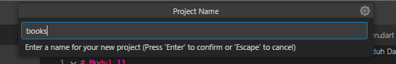
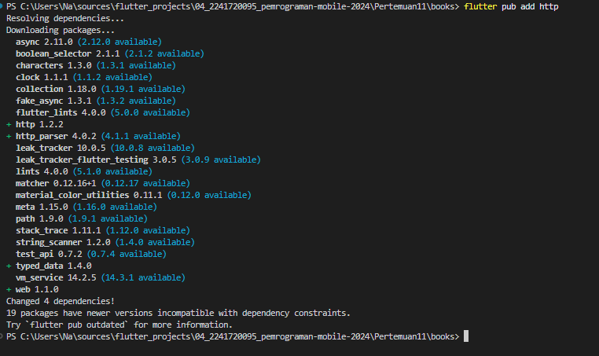
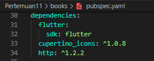
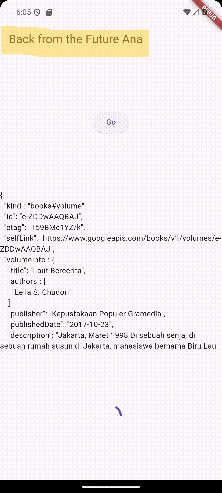
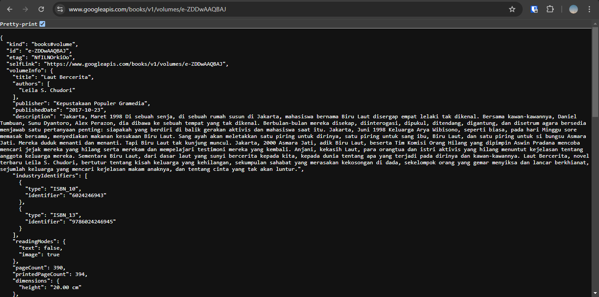
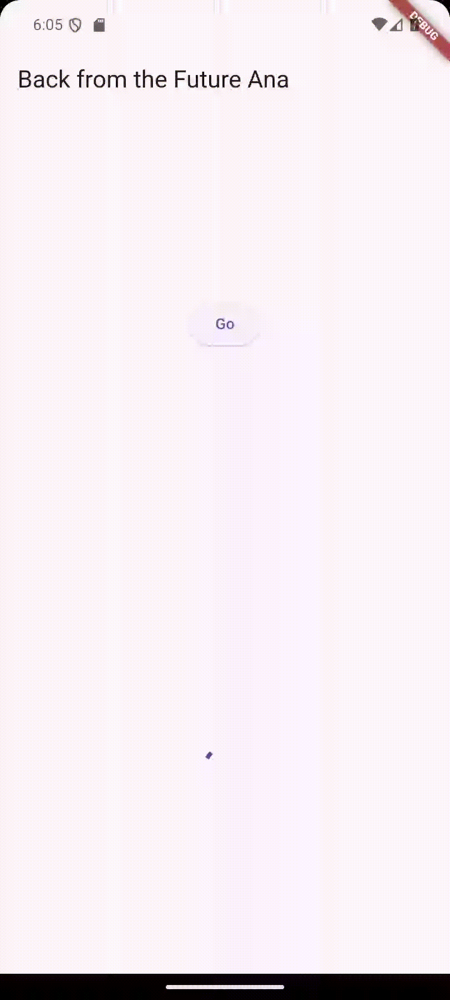
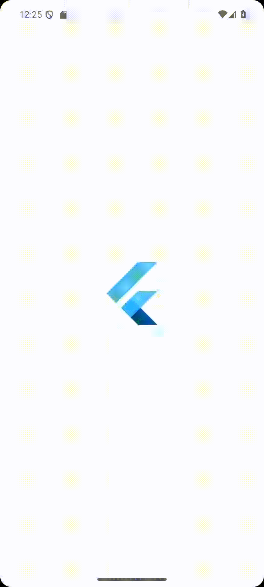

# Modul 11

---

#### NIM : 2241720095

#### Nama   : Ana Bellatus Mustaqfiro

#### Kelas   : D4 TI - 3F

#### No. Urut  : 04

#### Mata Kuliah  : Pemrograman Mobile (11 | Pemrograman Asynchronous)

---

## Praktikum 1 - Mengunduh Data dari Web Service (API)

**Langkah 1 - Buat project baru**



**Langkah 2 - cek file pubspec.yaml**


**Langkah 3 - Buka file main.dart**
**main.dart**

```dart
import 'package:flutter/material.dart';

void main() {
  runApp(const MyApp());
}

class MyApp extends StatelessWidget {
  const MyApp({super.key});
  @override
  Widget build(BuildContext context) {
    return MaterialApp(
      title: 'Flutter Demo Ana',
      theme: ThemeData(
        primarySwatch: Colors.blue,
        visualDensity: VisualDensity.adaptivePlatformDensity,
      ),
      home: const FuturePage(),
    );
  }
}

class FuturePage extends StatefulWidget {
  const FuturePage({super.key});

  @override
  State<StatefulWidget> createState() => _FuturePageState();
}

class _FuturePageState extends State<FuturePage> {
  String result = '';

  @override
  Widget build(BuildContext context) {
    return Scaffold(
      appBar: AppBar(
        title: const Text('Back from the Future Ana'),
      ),
      body: Center(
        child: Column(
          children: [
            const Spacer(),
            ElevatedButton(
              onPressed: () {},
              child: const Text('Go'),
            ),
            const Spacer(),
            Text(result),
            const Spacer(),
            const CircularProgressIndicator(),
            const Spacer(),
          ],
        ),
      ),
    );
  }
}
```

### Soal 1

Tambahkan nama panggilan Anda pada title app sebagai identitas hasil pekerjaan Anda.

> 
```dart
class _FuturePageState extends State<FuturePage> {
 //...
  @override
  Widget build(BuildContext context) {
    return Scaffold(
      appBar: AppBar(
        title: const Text('Back from the Future Ana'),
      ),
    ),
  }
}
```

**Langkah 4 - Tambah method getData()**
**main.dart**

```dart
class _FuturePageState extends State<FuturePage> {
  String result = '';

  Future<Response> getData() async {
    const authorithy = 'www.googleapis.com';
    const path = '/books/v1/volumes/e-ZDDwAAQBAJ';
    Uri url = Uri.https(authorithy, path);
    return http.get(url);
  }

  //...
}
```

### Soal 2

Carilah judul buku favorit Anda di Google Books, lalu ganti ID buku pada variabel path di kode tersebut.
**main.dart**

```dart
class _FuturePageState extends State<FuturePage> {
  String result = '';

  Future<Response> getData() async {
    const authorithy = 'www.googleapis.com';
    const path = '/books/v1/volumes/e-ZDDwAAQBAJ';
    Uri url = Uri.https(authorithy, path);
    return http.get(url);
  }

  //...
}
```

Kemudian cobalah akses di browser URI tersebut dengan lengkap seperti ini. Jika menampilkan data JSON, maka Anda telah berhasil.


**Langkah 5 - Tambah kode di ElevatedButton**
**main.dart**

```dart
class _FuturePageState extends State<FuturePage> {
  
  @override
  Widget build(BuildContext context) {
   //...
            ElevatedButton(
              child: const Text('Go'),
              onPressed: () {
                setState(() {});
                getData().then((value) {
                  result = value.body.toString().substring(0, 450);
                  setState(() {});
                }).catchError((_) {
                  result = 'An error occured';
                  setState(() {});
                });
              },
            ),
        //...
      }
}
```

### Soal 3

Jelaskan maksud kode langkah 5 tersebut terkait substring dan catchError!
> pada langkah tersebut substring digunakan untuk mendapatkan nilai string dari character index 0 hingga 450, pada value body yang telah diubah menjadi string yang kemudian disimpan di variabel result. Juga catchError yang digunakan untuk membuat exception ketika ada error value error nya disimpan juga di variabel result.

Capture hasil praktikum Anda berupa GIF


## Praktikum 2 - Menggunakan await/async untuk menghindari callbacks

**Langkah 1 - Buka file main.dart**
**main.dart**

```dart
class _FuturePageState extends State<FuturePage> {
  //...

  Future<int> returnOneAsync() async {
    await Future.delayed(const Duration(seconds: 3));
    return 1;
  }

  Future<int> returnTwoAsync() async {
    await Future.delayed(const Duration(seconds: 3));
    return 2;
  }

  Future<int> returnThreeAsync() async {
    await Future.delayed(const Duration(seconds: 3));
    return 3;
  }
}
```

**Langkah 2 - Tambah method count()**
**main.dart**

```dart
class _FuturePageState extends State<FuturePage> {
 //...
  Future count() async {
    int total = 0;
    total = await returnOneAsync();
    total += await returnTwoAsync();
    total += await returnThreeAsync();
    setState(() {
      result = total.toString();
    });
  }
  //...
}
```

**Langkah 3 - Panggil count()**
**main.dart**

```dart
class _FuturePageState extends State<FuturePage> {
  //...
@override
  Widget build(BuildContext context) {
    //...
      ElevatedButton(
        child: const Text('Go'),
        onPressed: () {
          count();
          },
        ),
  }
}
```

**Langkah 4 - Run**
Hasil

