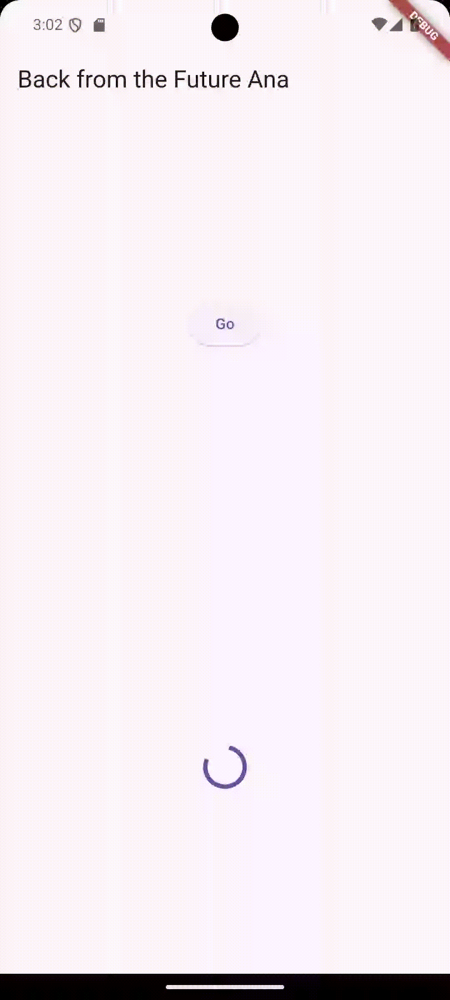
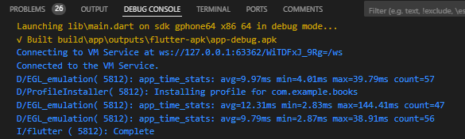
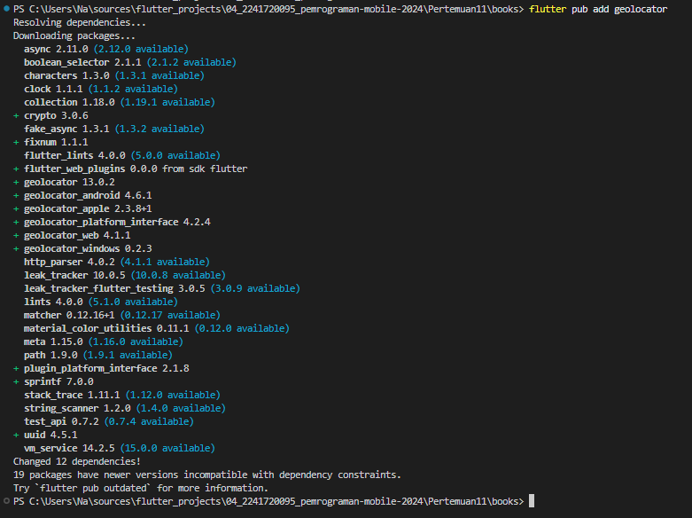
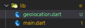

# Modul 11

---

#### NIM : 2241720095

#### Nama   : Ana Bellatus Mustaqfiro

#### Kelas   : D4 TI - 3F

#### No. Urut  : 04

#### Mata Kuliah  : Pemrograman Mobile (11 | Pemrograman Asynchronous)

---

## Praktikum 1 - Mengunduh Data dari Web Service (API)

**Langkah 1 - Buat project baru**


**Langkah 2 - cek file pubspec.yaml**


**Langkah 3 - Buka file main.dart**
**main.dart**

```dart
import 'package:flutter/material.dart';

void main() {
  runApp(const MyApp());
}

class MyApp extends StatelessWidget {
  const MyApp({super.key});
  @override
  Widget build(BuildContext context) {
    return MaterialApp(
      title: 'Flutter Demo Ana',
      theme: ThemeData(
        primarySwatch: Colors.blue,
        visualDensity: VisualDensity.adaptivePlatformDensity,
      ),
      home: const FuturePage(),
    );
  }
}

class FuturePage extends StatefulWidget {
  const FuturePage({super.key});

  @override
  State<StatefulWidget> createState() => _FuturePageState();
}

class _FuturePageState extends State<FuturePage> {
  String result = '';

  @override
  Widget build(BuildContext context) {
    return Scaffold(
      appBar: AppBar(
        title: const Text('Back from the Future Ana'),
      ),
      body: Center(
        child: Column(
          children: [
            const Spacer(),
            ElevatedButton(
              onPressed: () {},
              child: const Text('Go'),
            ),
            const Spacer(),
            Text(result),
            const Spacer(),
            const CircularProgressIndicator(),
            const Spacer(),
          ],
        ),
      ),
    );
  }
}
```

### Soal 1

Tambahkan nama panggilan Anda pada title app sebagai identitas hasil pekerjaan Anda.

> 
```dart
class _FuturePageState extends State<FuturePage> {
 //...
  @override
  Widget build(BuildContext context) {
    return Scaffold(
      appBar: AppBar(
        title: const Text('Back from the Future Ana'),
      ),
    ),
  }
}
```

**Langkah 4 - Tambah method getData()**
**main.dart**

```dart
class _FuturePageState extends State<FuturePage> {
  String result = '';

  Future<Response> getData() async {
    const authorithy = 'www.googleapis.com';
    const path = '/books/v1/volumes/e-ZDDwAAQBAJ';
    Uri url = Uri.https(authorithy, path);
    return http.get(url);
  }

  //...
}
```

### Soal 2

Carilah judul buku favorit Anda di Google Books, lalu ganti ID buku pada variabel path di kode tersebut.
**main.dart**

```dart
class _FuturePageState extends State<FuturePage> {
  String result = '';

  Future<Response> getData() async {
    const authorithy = 'www.googleapis.com';
    const path = '/books/v1/volumes/e-ZDDwAAQBAJ';
    Uri url = Uri.https(authorithy, path);
    return http.get(url);
  }

  //...
}
```

Kemudian cobalah akses di browser URI tersebut dengan lengkap seperti ini. Jika menampilkan data JSON, maka Anda telah berhasil.


**Langkah 5 - Tambah kode di ElevatedButton**
**main.dart**

```dart
class _FuturePageState extends State<FuturePage> {
  
  @override
  Widget build(BuildContext context) {
   //...
            ElevatedButton(
              child: const Text('Go'),
              onPressed: () {
                setState(() {});
                getData().then((value) {
                  result = value.body.toString().substring(0, 450);
                  setState(() {});
                }).catchError((_) {
                  result = 'An error occured';
                  setState(() {});
                });
              },
            ),
        //...
      }
}
```

### Soal 3

Jelaskan maksud kode langkah 5 tersebut terkait substring dan catchError!
> pada langkah tersebut substring digunakan untuk mendapatkan nilai string dari character index 0 hingga 450, pada value body yang telah diubah menjadi string yang kemudian disimpan di variabel result. Juga catchError yang digunakan untuk membuat exception ketika ada error value error nya disimpan juga di variabel result.

Capture hasil praktikum Anda berupa GIF


## Praktikum 2 - Menggunakan await/async untuk menghindari callbacks

**Langkah 1 - Buka file main.dart**
**main.dart**

```dart
class _FuturePageState extends State<FuturePage> {
  //...

  Future<int> returnOneAsync() async {
    await Future.delayed(const Duration(seconds: 3));
    return 1;
  }

  Future<int> returnTwoAsync() async {
    await Future.delayed(const Duration(seconds: 3));
    return 2;
  }

  Future<int> returnThreeAsync() async {
    await Future.delayed(const Duration(seconds: 3));
    return 3;
  }
}
```

**Langkah 2 - Tambah method count()**
**main.dart**

```dart
class _FuturePageState extends State<FuturePage> {
 //...
  Future count() async {
    int total = 0;
    total = await returnOneAsync();
    total += await returnTwoAsync();
    total += await returnThreeAsync();
    setState(() {
      result = total.toString();
    });
  }
  //...
}
```

**Langkah 3 - Panggil count()**
**main.dart**

```dart
class _FuturePageState extends State<FuturePage> {
  //...
@override
  Widget build(BuildContext context) {
    //...
      ElevatedButton(
        child: const Text('Go'),
        onPressed: () {
          count();
          },
        ),
  }
}
```

**Langkah 4 - Run**
Hasil


### Soal 4

Jelaskan maksud kode langkah 1 dan 2 tersebut!
> Pada langkah satu dibuat async function untuk melakukan delay atau waktu tunggu selama 3 detik pada masing" fungsinya dan mengembalikan sebuah nilai, kemudian pada langkah 2 dibuat method count untuk melakukan pemanggilan terhadap fungsi-fungsi async tadi dan melakukan penjumlahan terhadap nilai return dari masing-masing fungsi yang kemudian ditampilkan

## Praktikum 3 - Menggunakan Completer di Future

**Langkah 1 - Buka main.dart**
**main.dart**

```dart
import 'package:async/async.dart';
```

**Langkah 2 - Tambahkan variabel dan method**
**main.dart**

```dart
class _FuturePageState extends State<FuturePage> {
  //...

  late Completer completer;

  Future getNumber() {
    completer = Completer<int>();
    calculate();
    return completer.future;
  }

  Future calculate() async {
    await Future.delayed(const Duration(seconds: 5));
    completer.complete(42);
  }
  //...
}
```

**Langkah 3 - Ganti isi kode onPressed()**
**main.dart**

```dart
class _FuturePageState extends State<FuturePage> {
  //...
@override
  Widget build(BuildContext context) {
    //...
      ElevatedButton(
        child: const Text('Go'),
        onPressed: () {
          getNumber().then((value) {
          setState(() {
            result = value.toString();
              });
            });
          }
        ),
        //...
  }
}
```

**Langkah 4**
Hasil run


### Soal 5

Jelaskan maksud kode langkah 2 tersebut!
> pada langkah 2 tersebut dibuat fungsi async untuk mengembalikan nilai 42 dengan completer setelah waktu tunggu 5 detik, kemudian completer akan menampilkan hasilnya

**Langkah 5 - Ganti method calculate()**
**main.dart**

```dart
class _FuturePageState extends State<FuturePage> {
  //...

  calculate() async {
    try {
      await Future.delayed(const Duration(seconds: 5));
      completer.complete(42);
    } catch (_) {
      completer.completeError({});
    }
  }
}
```

**Langkah 6 - Pindah ke onPressed()**
**main.dart**

```dart
@override
  Widget build(BuildContext context) {
    //...
    ElevatedButton(
      child: const Text('Go'),
      onPressed: () {
        getNumber().then((value) {
          setState(() {
            result = value.toString();
            });
          }).catchError((e) {
              result = 'An error occured';
              });
      }
  }
```

### Soal 6

Jelaskan maksud perbedaan kode langkah 2 dengan langkah 5-6 tersebut!
> perbedaan kode langkah 2 dengan langkah 5-6 adalah, pada langkah 5-6 terdapat handling jika terjadi error pada pemanggilan calculate sehingga aplikasi tidak akan crash jika terjadi error, sedangkah pada langkah 2 tidak ada.
>
> Hasil
> 

## Praktikum 4 - Memanggil Future secara paralel

**Langkah 1 - Buka file main.dart**
**main.dart**

```dart
class _FuturePageState extends State<FuturePage> {
  //...

  void returnFG() {
    FutureGroup<int> futureGroup = FutureGroup<int>();
    futureGroup.add(returnOneAsync());
    futureGroup.add(returnTwoAsync());
    futureGroup.add(returnThreeAsync());
    futureGroup.close();
    futureGroup.future.then((List<int> value) {
      int total = 0;
      for (var element in value) {
        total += element;
      }
      setState(() {
        result = total.toString();
      });
    });
  }

  //...
}
```

**Langkah 2 - Edit onPressed()**
**main.dart**

```dart
class _FuturePageState extends State<FuturePage> {

@override
  Widget build(BuildContext context) {
    //...
    ElevatedButton(
      child: const Text('Go'),
      onPressed: () {
        returnFG();
        }
      )
  }
}
```

**Langkah 3 - Run**

### Soal 7 

Capture hasil praktikum Anda berupa GIF


**Langkah 4 - Ganti variabel futureGroup**
**main.dart**

```dart
class _FuturePageState extends State<FuturePage> {
  //...

  void returnFG() {
    final futures = Future.wait<int>([
      returnOneAsync(),
      returnTwoAsync(),
      returnThreeAsync(),
    ]);
    
    futures.then((List<int> value) {
      int total = 0;
      for (var element in value) {
        total += element;
      }
      setState(() {
        result = total.toString();
      });
    });
  }

  //...
}
```

Hasil


### Soal 8

Jelaskan maksud perbedaan kode langkah 1 dan 4!
> perbedaam kode langkah 1 dan 4 adalah kode pada langkah 1 digunakan ketika jumlah/daftar operasi asynchronous tidak diketahui di awal sehingga Future dapat ditambahkan saecara dinamis ke dalam FutureGroup sebelum di close(), juga memerlukan package tambahan yaitu async. Sementara pada langkah 4 digunakan ketika jumlah/daftar operasi asynchronous sudah diketahui di awal, saehingga tidak memerlukan deklarasi tambahan atau dependensi eksternal

## Praktikum 5 - Menangani Respon Error pada Async Code

**Langkah 1 - Buka file main.dart**
**main.dart**

```dart
class _FuturePageState extends State<FuturePage> {
  //...

  Future returnError() async {
    await Future.delayed(const Duration(seconds: 2));
    throw Exception('Something terrible happened!');
  }
  //...
}
```

**Langkah 2 - ElevatedButton**
**main.dart**

```dart
class _FuturePageState extends State<FuturePage> {
  //...

@override
  Widget build(BuildContext context) {
    return Scaffold(
      ElevatedButton(
        child: const Text('Go'),
        onPressed: () {
          returnError().then((value) {
            setState(() {
              result = 'Success';
              });
            }).catchError((onError) {
                setState(() {
                  result = onError.toString();
                  });
                }).whenComplete(() => print('Complete'));
        }
      )
    )
  }
}
```

**Langkah 3 - Run**

Pada bagian debug console


### Soal 9

Capture hasil praktikum Anda berupa GIF


**Langkah 4 - Tambah method handleError()**
**main.dart**

```dart
class _FuturePageState extends State<FuturePage> {
  //...

  Future handleErrors() async {
    try {
      await returnError();
    } catch (error) {
      setState(() {
        result = error.toString();
      });
    } finally {
      print('Complete');
    }
  }

  //...
}
```

### Soal 10

Panggil method handleError() tersebut di ElevatedButton,
```dart
@override
  Widget build(BuildContext context) {
    ElevatedButton(
      child: const Text('Go'),
      onPressed: () {
        handleErrors();
      }
    )
  }
```

lalu run. Apa hasilnya?


Jelaskan perbedaan kode langkah 1 dan 4!
> pada langkah 1 digunakan untuk logika yang lebih sederhana, sedangkan pada langkah 4 digunakan untuk logika yang lebih kompleks

## Praktikum 6 - Menggunakan Future dengan StatefulWidget

**Langkah 1 - install plugin geolocator**


**Langkah 2 - Tambah permission GPS**
**androidmanifest.xml**

```dart
<manifest xmlns:android="http://schemas.android.com/apk/res/android">

<uses-permission android:name="android.permission.ACCESS_FINE_LOCATION"/>
<uses-permission android:name="android.permission.ACCESS_COARSE_LOCATION"/>
</manifest>
```

**Langkah 3 - Buat file geolocation.dart**


**Langkah 4 - Buat StatefulWidget**
**geolocation.dart**

```dart
class LocationScreen extends StatefulWidget {
  const LocationScreen({super.key});

  @override
  State<LocationScreen> createState() => _LocationScreenState();
}

class _LocationScreenState extends State<LocationScreen> {
}
```

**Langkah 5 - Isi kode geolocation.dart**
**geolocation.dart**

```dart
import 'package:flutter/material.dart';
import 'package:geolocator/geolocator.dart';

class LocationScreen extends StatefulWidget {
  const LocationScreen({super.key});

  @override
  State<LocationScreen> createState() => _LocationScreenState();
}

class _LocationScreenState extends State<LocationScreen> {
  String myPosition = '';

  @override
  void initState() {
    super.initState();
    getPosition().then((Position myPos) {
      myPosition =
          'Latitude: ${myPos.latitude.toString()} - Longitude: ${myPos.longitude.toString()}';
      setState(() {
        myPosition = myPosition;
      });
    });
  }

  @override
  Widget build(BuildContext context) {
    return Scaffold(
      appBar: AppBar(
        title: const Text('Current Location'),
      ),
      body: Center(
        child: Text(myPosition),
      ),
    );
  }

  Future<Position> getPosition() async {
    await Geolocator.requestPermission();
    await Geolocator.isLocationServiceEnabled();
    Position? position = await Geolocator.getCurrentPosition();
    return position;
  }
}
```