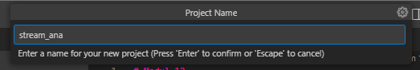
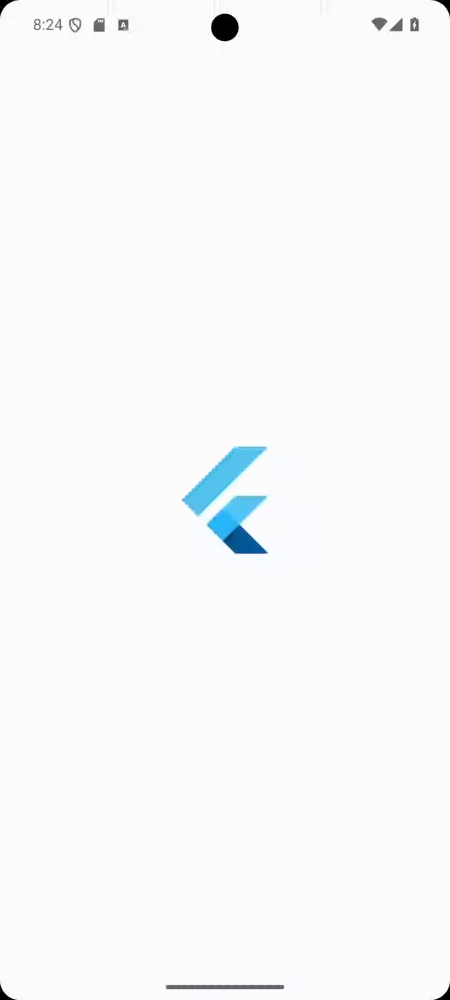
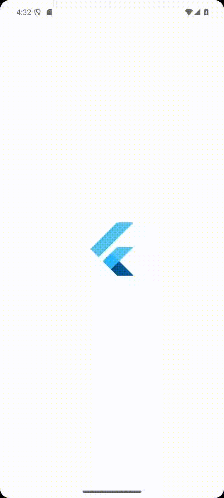
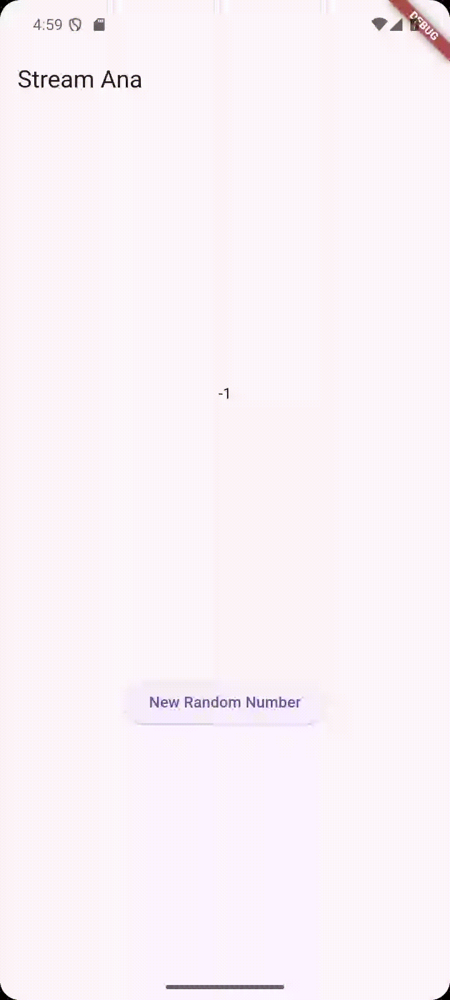
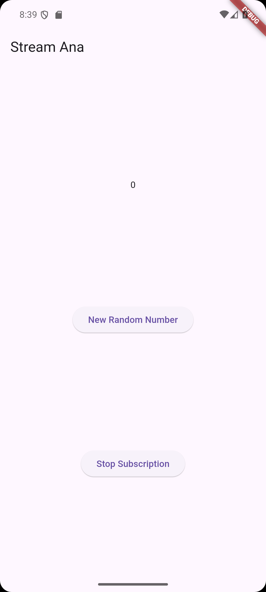
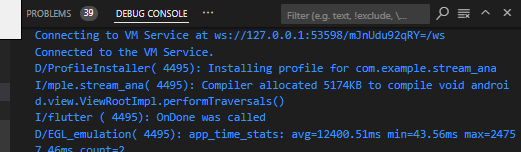
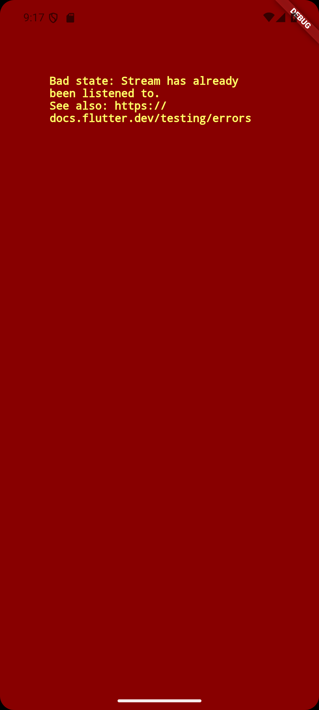
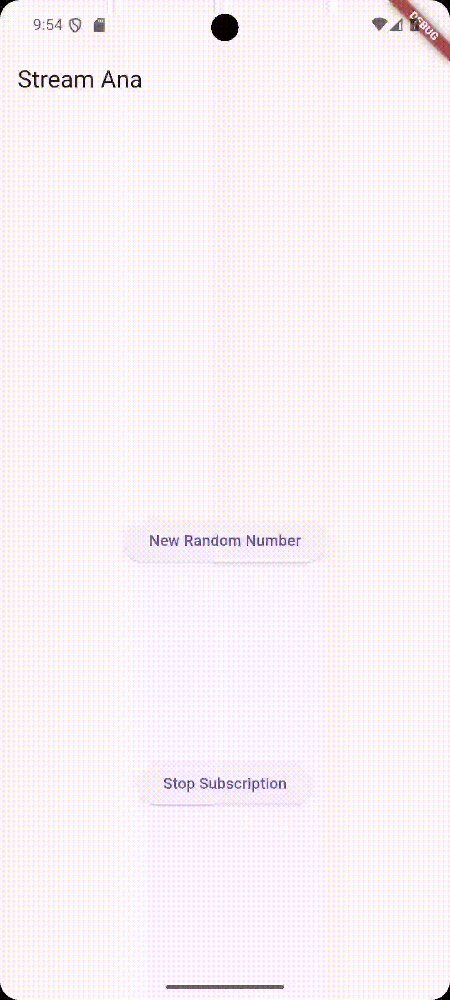
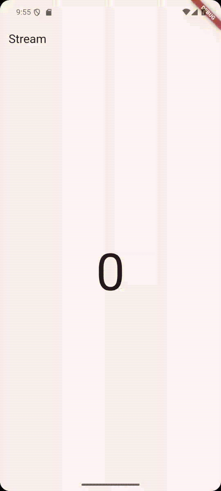
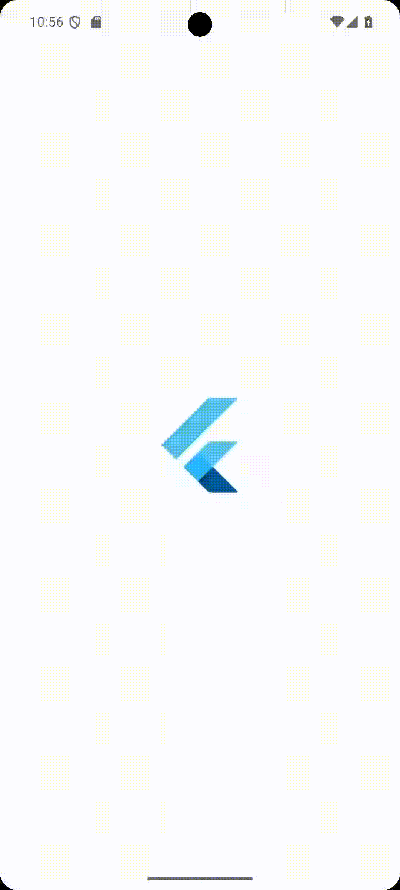

# Modul 12

---

#### NIM : 2241720095

#### Nama   : Ana Bellatus Mustaqfiro

#### Kelas   : D4 TI - 3F

#### No. Urut  : 04

#### Mata Kuliah  : Pemrograman Mobile (12 | Lanjutan State Management dengan Streams)

---

## Praktikum 1 - Dart Streams

**Langkah 1 - Buat project baru**


**Langkah 2 - Buka file main.dart**
**main.dart**

```dart
import 'package:flutter/material.dart';

void main() {
  runApp(const MyApp());
}

class MyApp extends StatelessWidget {
  const MyApp({super.key});

  @override
  Widget build(BuildContext context) {
    return MaterialApp(
      title: 'Stream',
      theme: ThemeData(
        primarySwatch: Colors.deepPurple,
      ),
      home: const StreamHomePage(),
    );
  }
}

class StreamHomePage extends StatefulWidget {
  const StreamHomePage({super.key});

  @override
  State<StreamHomePage> createState() => _StreamHomePageState();
}

class _StreamHomePageState extends State<StreamHomePage> {
  @override
  Widget build(BuildContext context) {
    return Container();
  }
}
```

### Soal 1

- Tambahkan nama panggilan Anda pada title app sebagai identitas hasil pekerjaan Anda.
- Gantilah warna tema aplikasi sesuai kesukaan Anda.
```dart
class MyApp extends StatelessWidget {
  const MyApp({super.key});

  @override
  Widget build(BuildContext context) {
    return MaterialApp(
      title: 'Stream Ana',
      theme: ThemeData(
        primarySwatch: Colors.blue,
      ),
      home: const StreamHomePage(),
    );
  }
}
```

**Langkah 3 - Buat file baru stream.dart**
**streams.dart**

```dart
class ColorStream {
  
}
```

**Langkah 4 - Tambah variabel colors**
**streams.dart**

```dart
import 'package:flutter/material.dart';

class ColorStream {
  final List<Color> colors = [
    Colors.blueGrey,
    Colors.amber,
    Colors.blue,
    Colors.deepPurple,
    Colors.lightBlue,
    Colors.teal,
  ];
}
```

### Soal 2

- Tambahkan 5 warna lainnya sesuai keinginan Anda pada variabel colors tersebut.
```dart
class ColorStream {
  final List<Color> colors = [
    Colors.blueGrey,
    Colors.amber,
    Colors.blue,
    Colors.deepPurple,
    Colors.lightBlue,
    Colors.teal,
    Colors.red,
    Colors.green,
    Colors.purple,
    Colors.orange,
    Colors.pink,
  ];
}
```

**Langkah 5 - Tambah method getColors()**
**streams.dart**

```dart
class ColorStream {
  //...
  Stream<Color> getColors() async* {
  }
}
```

**Langkah 6 - Tambah perintah yield**
**streams.dart**

```dart
class ColorStream {
  Stream<Color> getColors() async* {
    yield* Stream.periodic(const Duration(seconds: 1), (int t) {
      int index = t % colors.length;
      return colors[index];
    });
  }
}
```

### Soal 3

- Jelaskan fungsi keyword yield* pada kode tersebut!
  > yield* digunakan untuk menggabungkan elemen-elemen dari stream lain (Stream.periodic) ke dalam stream yang sedang dibuat (getColors).

- Apa maksud isi perintah kode tersebut?
  > isi perintah kode tersebut bermaksud untuk menghasilkan stream yang memancarkan warna-warna dari daftar colors secara periodik setiap detik, dengan menggunakan Stream.periodic untuk menghasilkan nilai secara periodik dan yield* untuk mendistribusikan nilai-nilai tersebut ke dalam stream yang dihasilkan oleh getColors.

**Langkah 7 - Buka main.dart**
**main.dart**

```dart
import 'stream.dart';
//...
```

**Langkah 8 - Tambah variabel**
**main.dart**

```dart
class _StreamHomePageState extends State<StreamHomePage> {

  Color bfColor = Colors.blueGrey;
  late ColorStream colorStream;
  //...
}
```

**Langkah 9 - Tambah method changecolor()**
**main.dart**

```dart
class _StreamHomePageState extends State<StreamHomePage> {

  Color bfColor = Colors.blueGrey;
  late ColorStream colorStream;

  void changeColor() async{
    await for (var eventColor in colorStream.getColors()) {
      setState(() {
        bfColor = eventColor;
      });
    }
  }
}
```

**Langkah 10 - Lakukan override initState()**
**main.dart**

```dart
class _StreamHomePageState extends State<StreamHomePage> {
//...

  @override
  void initState() {
    super.initState();
    colorStream = ColorStream();
    changeColor();
  }
}
```

**Langkah 11 - ubah isi scaffold()**
**main.dart**

```dart
class _StreamHomePageState extends State<StreamHomePage> {
  @override
  Widget build(BuildContext context) {
    return Scaffold(
      appBar: AppBar(
        title: const Text('Stream Ana'),
      ),
      body: Center(
        child: Container(
          decoration: BoxDecoration(color: bgColor),
        ),
      ),
    );
  }
}
```

**Langkah 12 - Run**


### Soal 4 


**Langkah 13 - Ganti isi method changeColor()**
**main.dart**

```dart
class _StreamHomePageState extends State<StreamHomePage> {
  void changeColor() async {
    colorStream.getColors().listen((eventColor) {
      setState(() {
        bgColor = eventColor;
      });
    });
  }
}
```

### Soal 5
- Jelaskan perbedaan menggunakan listen dan await for (langkah 9!)
  > Perbedaannya adalah listen menggunakan callback untuk menangani data, kesalahan, dan penyelesaian stream sehingga tidak menghentikan eksekusi kode lainnya, memungkinkan kode lain untuk berjalan secara paralel. Sedangkan await menggunakan loop untuk mengiterasi data yang dipancarkan oleh stream sehingga menghentikan eksekusi kode lainnya sampai semua data dari stream telah diterima atau stream selesai.

## Praktikum 2 - Stream controllers dan sinks

**Langkah 1: Buka file stream.dart**
**stream.dart**

```dart
import 'dart:async';
//...
```

**Langkah 2: Tambah class NumberStream**
**stream.dart**

```dart
//...
class NumberStream { 
}
```

**Langkah 3: Tambah StreamController**
**stream.dart**

```dart
//...
class NumberStream {
  final StreamController<int> controller = StreamController<int>();
}
```

**Langkah 4: Tambah method addNumberToSink**
**stream.dart**

```dart
//...
class NumberStream {
  //...

  void addNumberToSink(int newNumber) {
    controller.sink.add(newNumber);
  }
}
```

**Langkah 5: Tambah method close()**
**stream.dart**

```dart
//...
class NumberStream {
  //...

  close(){
    controller.close();
  }
}
```

**Langkah 6: Buka main.dart**
**main.dart**

```dart
//...
import 'dart:math';
//...
```

**Langkah 7: Tambah variabel**
**main.dart**

```dart
class _StreamHomePageState extends State<StreamHomePage> {
  int lastNumber = 0;
  late StreamController numberStreamController;
  late NumberStream numberStream;
}
```

**Langkah 8: Edit initState()**
**main.dart**

```dart
class _StreamHomePageState extends State<StreamHomePage> {
  //...
  @override
  void initState() {
    super.initState();
    numberStream = NumberStream();
    numberStreamController = numberStream.controller;
    Stream stream = numberStreamController.stream;
    stream.listen((event) {
      setState(() {
        lastNumber = event;
      });
    });
  }
}
```

**Langkah 9: Edit dispose()**
**main.dart**

```dart
class _StreamHomePageState extends State<StreamHomePage> {
  //...
  @override
  void dispose() {
    numberStreamController.close();
    super.dispose();
  }
  //...
}
```

**Langkah 10: Tambah method addRandomNumber()**
**main.dart**

```dart
class _StreamHomePageState extends State<StreamHomePage> {
  //...
  void addRandomNumber(){
    Random random = Random();
    int myNum = random.nextInt(10);
    numberStream.addNumberToSink(myNum);
  }
  //...
}
```

**Langkah 11: Edit method build()**
**main.dart**

```dart
class _StreamHomePageState extends State<StreamHomePage> {
  Widget build(BuildContext context) {
    return Scaffold(
      appBar: AppBar(
        title: const Text('Stream Ana'),
      ),
      body: SizedBox(
        width: double.infinity,
        child: Column(
          mainAxisAlignment: MainAxisAlignment.spaceEvenly,
          crossAxisAlignment: CrossAxisAlignment.center,
          children: [
            Text(lastNumber.toString()),
            ElevatedButton(
              onPressed: () => addRandomNumber(),
              child: const Text('New Random Number'),
            ),
          ],
        ),
      ),
    );
  }
}
```

**Langkah 12 - Run**


### Soal 6

- Jelaskan maksud kode langkah 8 dan 10 tersebut!
  > langkah 8 Menginisialisasi NumberStream dan StreamController, kemudian melakukan listen stream untuk menerima data yang dipancarkan. Setiap kali ada data baru, state lastNumber diperbarui dan UI diperbarui Sedangkan langkah 10 menambahkan method addRandomNumber yang menghasilkan angka random dan menambahkannya ke dalam stream menggunakan metode addNumberToSink.


**Langkah 13: Buka stream.dart**
**stream.dart**

```dart
//...
class NumberStream {
  final StreamController<int> controller = StreamController<int>();
  //...  
  addError(){
    controller.sink.addError('Error');
  }
}
```

**Langkah 14: Buka main.dart**
**main.dart**

```dart
class _StreamHomePageState extends State<StreamHomePage> {
  //...
  @override
  void initState() {
    //...
    stream.listen((event) {
      setState(() {
        lastNumber = event;
      });
    }).onError((error) {
      setState(() {
        lastNumber = -1;
      });
    });
  }
  //...
}
```

**Langkah 15: Edit method addRandomNumber()**
**main.dart**

```dart
class _StreamHomePageState extends State<StreamHomePage> {
  void addRandomNumber() {
    Random random = Random();
    numberStream.addError();
  }
}
```

### Soal 7

- Jelaskan maksud kode langkah 13 sampai 15 tersebut!
  > Langkah 13-15 digunakan untuk menambahkan error dan cara handlenya ke dalam sink, kemudian pada initState dilakukan set value last number dengan -1 jika terjadi error pada stream listen, kemudian error ditambahkan dengan memanggil addError()

- Kembalikan kode seperti semula pada Langkah 15, comment addError() agar Anda dapat melanjutkan ke praktikum 3 berikutnya.
**main.dart**

```dart
class _StreamHomePageState extends State<StreamHomePage> {
  void addRandomNumber() {
    Random random = Random();
    int myNum = random.nextInt(10);
    numberStream.addNumberToSink(myNum);
    // numberStream.addError();
  }
}
```

## Praktikum 3 - Injeksi data ke streams

**Langkah 1 - Buka main.dart**
**main.dart**

```dart
class _StreamHomePageState extends State<StreamHomePage> {
  late StreamTransformer transformer;
  //...
}
```

**Langkah 2 - Tambahkan kode ini di initState**
**main.dart**

```dart
class _StreamHomePageState extends State<StreamHomePage> {
  @override
  void initState() {
    //...

    transformer =
        StreamTransformer<int, int>.fromHandlers(handleData: (value, sink) {
      sink.add(value * 10);
    }, handleError: (error, trace, sink) {
      sink.add(-1);
    }, handleDone: (sink) {
      sink.close();
    });
  }
  //...
} 
```

**Langkah 3 - Tetap di initState**
**main.dart**

```dart
class _StreamHomePageState extends State<StreamHomePage> {
  @override
  void initState() {
    //...
  stream.transform(transformer).listen((event) {
      setState(() {
        lastNumber = event;
      });
    }).onError((error) {
      setState(() {
        lastNumber = -1;
      });
    });
  }
  //...
}
```

**Langkah 4 - Run**


### Soal 8

- Jelaskan maksud kode langkah 1-3 tersebut!

> pada langkah 1-3 StreamTransformer digunakan untuk mengubah data yang dipancarkan oleh stream, menangani kesalahan, dan menangani penyelesaian stream. Langkah 1 mendeklarasikan variabel transformer dari tipe StreamTransformer yang akan diinisialisasi nanti. Langkah 2 menginisialisasi transformer dengan StreamTransformer yang mengubah data, handle error, dan handle penyelesaian stream. Langkah 3 mengimplementasikan transformer ke stream, mendengarkan stream yang telah ditransformasi untuk menerima data yang dipancarkan, dan memperbarui state lastNumber serta UI berdasarkan data atau error yang diterima dari stream.
>

## Praktikum 4 - Subcribe ke stream events

**Langkah 1 - Tambah variabel**
**main.dart**

```dart
class _StreamHomePageState extends State<StreamHomePage> {
  //...
  late StreamSubscription subscription;
  //...
}
```

**Langkah 2 - Edit initState()**
**main.dart**

```dart
@override
  void initState() {
    super.initState();
    numberStream = NumberStream();
    numberStreamController = numberStream.controller;
    Stream stream = numberStreamController.stream;
    subscription = stream.listen((event) {
      setState(() {
        lastNumber = event;
      });
    });
  }
```

**Langkah 3 - Tetap di initState**
**main.dart**

```dart
@override
  void initState() {
    super.initState();
    //...
    subscription.onError((error) {
      setState(() {
        lastNumber = -1;
      });
    });
  }
```

**Langkah 4 - Tambah poperti onDone()**
**main.dart**

```dart
subscription.onDone(() {
      print('OnDone was called');
    });
```

**Langkah 5 - Tambah method baru**
**main.dart**

```dart
class _StreamHomePageState extends State<StreamHomePage> {
  //...

  void stopStream() {
    numberStreamController.close();
  }
}
```

**Langkah 6 - Pindah e method dispose()**
**main.dart**

```dart
@override
  void dispose() {
    //...
    subscription.cancel();
  }
```

**Langkah 7 - Pindah ke method build()**
**main.dart**

```dart
@override
  Widget build(BuildContext context) {
    //...
    ElevatedButton(
      onPressed: () => stopStream(),
      child: const Text('Stop Subscription'),
      ),
  }
```

**Langkah 8 - Edit method addRandomNumber()**
**main.dart**

```dart
void addRandomNumber() {
    Random random = Random();
    int myNum = random.nextInt(10);
    if (!numberStreamController.isClosed) {
      numberStream.addNumberToSink(myNum);
    } else {
      setState(() {
        lastNumber = -1;
      });
    }
  }
```

**Langkah 9 - Run**


**Langkah 10 - Tekan button 'Stop Subscription**


### Soal 9

- Jelaskan maksud kode langkah 2, 6 dan 8 tersebut!
  
> Pada Langkah 2 subscription yang akan melakukan listen setiap event dari stream diinisialisasi, ketika event baru diterima, setState() dipanggil untuk memperbarui nilai variabel lastNumber dengan nilai event tersebut.
> Pada langkah 6 dilakukan pembersihan (dispose) resource yang digunakan oleh stream agar tidak terjadi memory leak.
> Pada langkah 8 data baru dikirimkan ke StreamController jika controller belum ditutup. Jika controller sudah ditutup, aplikasi akan memperbarui nilai lastNumber ke -1.
>

## Praktikum 5 - Multiple stream subcriptions

**Langkah 1: Buka file main.dart**
**main.dart**

```dart
class _StreamHomePageState extends State<StreamHomePage> {
  late StreamSubscription subscription2;
  String values = '';
}
```

**Langkah 2: Edit initState()**
**main.dart**

```dart
@override
  void initState() {
    super.initState();
    numberStream = NumberStream();
    numberStreamController = numberStream.controller;
    Stream stream = numberStreamController.stream;
    subscription = stream.listen((event) {
      setState(() {
        // lastNumber = event;
        values += '$event - ';
      });
    });

    subscription2 = stream.listen((event) {
      setState(() {
        values += '$event - ';
      });
    });
  }
```

**Langkah 3: Run**


### Soal 10

- Jelaskan mengapa error itu bisa terjadi?
  > error tersebut terjadi karena stream default pada Dart hanya bisa memiliki satu subscriber. kode pada langkah 2 membuat subscription kedua pada stream yang sama, Dart akan memunculkan error "Stream has already been listened to" karena aturan ini melarang multiple subscriptions.

**Langkah 4: Set broadcast stream**
**main.dart**

```dart
@override
  void initState() {
    super.initState();
    numberStream = NumberStream();
    numberStreamController = numberStream.controller;

    Stream stream = numberStreamController.stream.asBroadcastStream();
  }
```

**Langkah 5: Edit method build()**
**main.dart**

```dart
  @override
  Widget build(BuildContext context) {
    return Scaffold(
        //...
        body: SizedBox(
          width: double.infinity,
          child: Column(
            //...
            children: [
              Text(values),
            ]
          ),
        ),
    ),
  }
```

**Langkah 6: Run**


### Soal 11

- Jelaskan mengapa hal itu bisa terjadi?
  > Setelah stream diubah menjadi broadcast stream, setiap kali tombol New Random Number ditekan, event baru dikirimkan ke semua subscriber. Hal ini menyebabkan teks angka pada aplikasi bertambah terus setiap kali event baru diterima. Ini terjadi karena broadcast stream mengizinkan banyak subscriber, dan setiap subscriber mendapatkan event yang sama.

## Praktikum 6 - StreamBuilder

***Langkah 1 - Buat project baru**

**Langkah 2 - Buat file baru stream.dart**
**stream.dart**

```dart
class NumberStream{}
```

**Langkah 3 - Tetap di file stream.dart**
**stream.dart**

```dart
import 'dart:math';

class NumberStream{
  Stream<int> getNumber() async* {
    yield* Stream.periodic(const Duration(seconds: 1), (int t) {
      Random random = Random();
      int myNum = random.nextInt(100);
      return myNum;
    });
  }
}
```

**Langkah 4 - Edit main**
**main.dart**

```dart
import 'package:flutter/material.dart';

void main() {
  runApp(const MyApp());
}

class MyApp extends StatelessWidget {
  const MyApp({super.key});

  @override
  Widget build(BuildContext context) {
    return MaterialApp(
      title: 'Stream',
      theme: ThemeData(primarySwatch: Colors.deepPurple),
      home: const StreamHomePage(),
    );
  }
}

class StreamHomePage extends StatefulWidget {
  const StreamHomePage({super.key});

  @override
  State<StreamHomePage> createState() => _StreamHomePageState();
}

class _StreamHomePageState extends State<StreamHomePage> {
  @override
  Widget build(BuildContext context) {
    return Scaffold(
      appBar: AppBar(
        title: const Text('Stream'),
      ),
      body: Container(),
    );
  }
}
```

**Langkah 5 - Tambah variabel**
**main.dart**

```dart
class _StreamHomePageState extends State<StreamHomePage> {

  late Stream<int> numberStream;
}
```

**Langkah 6 - Edit initState()**
**main.dart**

```dart
class _StreamHomePageState extends State<StreamHomePage> {
  late Stream<int> numberStream;

  @override
  void initState() {
    numberStream = NumberStream().getNumber();
    super.initState();
  }
}
```

**Langkah 7 - Edit method build()**
**main.dart**

```dart
class _StreamHomePageState extends State<StreamHomePage> {
  late Stream<int> numberStream;
  @override
  Widget build(BuildContext context) {
    return Scaffold(
      appBar: AppBar(
        title: const Text('Stream'),
      ),
      body: StreamBuilder(
        stream: numberStream,
        initialData: 0,
        builder: (context, snapshot) {
          if (snapshot.hasError) {
            print('Error');
          }
          if (snapshot.hasData) {
            return Center(
              child: Text(
                snapshot.data.toString(),
                style: const TextStyle(fontSize: 96),
              ),
            );
          } else {
            return SizedBox.shrink();
          }
        },
      ),
    );
  }
}
```

**Langkah 8 - Run**


### Soal 12

- Jelaskan maksud kode pada langkah 3 dan 7
  > langkah 3 bermaksud untuk membuat stream angka acak yang menghasilkan nilai setiap detik, sedangkan langkah 7 menggunakan StreamBuilder untuk menampilkan angka terbaru yang dihasilkan stream tersebut dalam UI aplikasi.

## Praktikum 7 - BLoC Pattern

***Langkah 1 - Buat Project Baru**

**Langkah 2 - Isi kode random_bloc.dart**
**random_bloc.dart**

```dart
import 'dart:async';
import 'dart:math';
```

**Langkah 3 - Buat class RandomNumberBloc()**
**random_bloc.dart**

```dart
class RandomNumberBloc{}
```

**Langkah 4 - Buat variabel StreamController**
**random_bloc.dart**

```dart
class RandomNumberBloc {
  final _generateRandomController = StreamController<void>();

  final _randomNumberController = StreamController<int>();

  Sink<void> get generateRandom => _generateRandomController.sink;

  Stream<int> get randomNumber => _randomNumberController.stream;

}
```

**Langkah 5 - Buat constructor**
**random_bloc.dart**

```dart
class RandomNumberBloc {
  RandomNumberBloc() {
    _generateRandomController.stream.listen((_) {
      final random = Random().nextInt(10);
      _randomNumberController.sink.add(random);
    });
  }
}
```

**Langkah 6 Buat method dispose()**
**random_bloc.dart**

```dart
class RandomNumberBloc {
  void dispose() {
    _generateRandomController.close();
    _randomNumberController.close();
  }
}
```

**Langkah 7 - Edit main.dart**
**main.dart**

```dart
class MyApp extends StatelessWidget {
  const MyApp({super.key});

  @override
  Widget build(BuildContext context) {
    return MaterialApp(
      title: 'Flutter Demo',
      theme: ThemeData(primarySwatch: Colors.blue,
      ),
      home: const RandomScreen(),
    );
  }
}
```

**Langkah 8 - Buat file baru random_screen.dart**
**random_screen.dart**

**Langkah 9 - Lakukan impor material dan random_bloc.dart**
**random_screen.dart**

```dart
import 'package:flutter/material.dart';
import 'random_bloc.dart';
```

**Langkah 10 - Buat StatefulWidget randomScreen**
**random_screen.dart**

```dart
class RandomScreen extends StatefulWidget {
  const RandomScreen({super.key});

  @override
  State<RandomScreen> createState() => _RandomScreenState();
}
```

**Langkah 11 - Buat variabel**
**random_screen.dart**

```dart
class _RandomScreenState extends State<RandomScreen> {
  final _bloc = RandomNumberBloc();
}
```

**Langkah 12 - Buat method dispose()**
**random_screen.dart**

```dart
class _RandomScreenState extends State<RandomScreen> {
  //...

  @override
  void dispose() {
    _bloc.dispose();
    super.dispose();
  }
}
```

**Langkah 13 - Edit method build()**
**random_screen.dart**

```dart
@override
  Widget build(BuildContext context) {
    return Scaffold(
      appBar: AppBar(
        title: const Text('Random Number'),
      ),
      body: Center(
        child: StreamBuilder(
          stream: _bloc.randomNumber,
          initialData: 0,
          builder: (context, snapshot) {
            return Text(
              'Random Number: ${snapshot.data}',
              style: const TextStyle(fontSize: 24),
            );
          },
        ),
      ),
      floatingActionButton: FloatingActionButton(
        onPressed: () => _bloc.generateRandom.add(null),
        child: const Icon(Icons.refresh),
      ),
    );
  }
```

**Run aplikasi**


## Soal 13

- Jelaskan maksud praktikum ini ! Dimanakah letak konsep pola BLoC-nya ?
  > praktikum ini bermaksud untuk memahami konsep BLoC dengan membuat kelas RandomNumberBloc yang bertindak sebagai pusat logika bisnis. dan Menggunakan StreamController untuk mengelola aliran data (stream) dan sink.
> Letak konsep pola BLoC nya ada pada Stream sebagai jembatan data yaitu 
> 1. data dari StreamController (_generateRandomController) dipancarkan melalui getter randomNumber.kemudian widget melakukan listen perubahan data dari stream ini menggunakan StreamBuilder.
> 2. Input diterima melalui sink _generateRandomController.sink. 
> 3. Semua logika bisnis, seperti pembuatan angka acak, dilakukan di dalam kelas RandomNumberBloc.UI hanya mendengarkan dan menampilkan data dari stream.