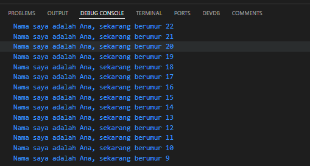

# Modul 2

---

#### NIM : 2241720095

#### Nama   : Ana Bellatus Mustaqfiro

#### Kelas   : D4 TI - 3F

#### No. Urut  : 04

#### Mata Kuliah  : Pemrograman Mobile (2 |  Pengantar Bahasa Pemrograman Dart - Bagian 1)

---

## Tugas Praktikum

## Soal 1

Modifikasilah kode pada baris 3 di VS Code atau Editor Code favorit Anda berikut ini agar mendapatkan keluaran (output) sesuai yang diminta!

```
void main() { 
  int myAge = 22;
   for (int i = myAge; i > 8; i--) { 
    print('Nama saya adalah Ana, sekarang berumur ${i}'); 
  } 
}
```



## Soal 2

Mengapa sangat penting untuk memahami bahasa pemrograman Dart sebelum kita menggunakan framework Flutter ? Jelaskan!
> Karena Dart merupakan bahasa pemrograman inti yang digunakan dalam framework flutter, mendukung multi platform dan fleksibel sehingga developer harus bisa menguasai dasar-dasar pemrograman dart agar bisa mengembangkan aplikasi flutter yang baik

## Soal 3

Rangkumlah materi dari codelab ini menjadi poin-poin penting yang dapat Anda gunakan untuk membantu proses pengembangan aplikasi mobile menggunakan framework Flutter.
> Bahasa dart digunakan sebagai dasar dalam pengembangan aplikasi flutter. Dart mendukung pengembangan lintas platform atau biasa disebut dengan multi platform dengan tujuan untuk meningkatkan fitur-fiturnya sehingga menjadi lebih fleksibel
 Beberapa kelebihan Bahasa pemrograman dart :
>
> * Productive tooling
> * Garbage collection
> * Type annotations
> * Statically typed
> * Portability
>
> Kode dart dieksekusi dalam 2 mode yaitu:
>
> * Just-in-Time (JIT)
> ketika kode dijalankan setelah proses kompilasi seperti pada fitur debugging dan hot reload (jika ada perubahan kode maka bisa langsung dijalankan)
> * Ahead-Of-Time(AOT)
> ketika kode dikompilasi pada bagian awal
>
> Dart mendukung OOP sehingga dalam dart dapat dilakukan encapsulasi, inheritance, komposisi, abstraksi, dan polimorfisme.
> Dart mendukung banyak operator seperti:
>
> * Operator aritmatika (+, -, *, /, ~/, %, -expression)
> * Operator increment & decrement (++var, var++, --var, var--)
> * Equality (==, !=) dan operational operator (>, <, >=, <=)
> * Logical operator (!expression, ||, &&) yang menghasilkan nilai boolean (True/False)
