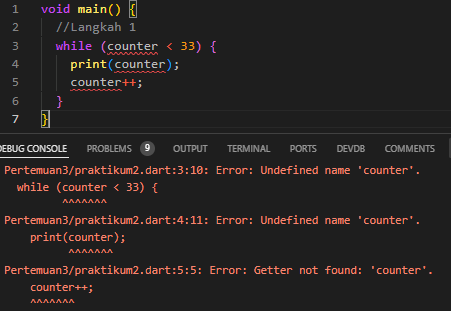

# Modul 3

---

#### NIM : 2241720095

#### Nama   : Ana Bellatus Mustaqfiro

#### Kelas   : D4 TI - 3F

#### No. Urut  : 04

#### Mata Kuliah  : Pemrograman Mobile (3 |  Pengantar Bahasa Pemrograman Dart - Bagian 2)

---

## Praktikum 1 Menerapkan Control Flows ("if/else")

**Langkah 1**

```
    void main() {
    String test = "test2";
    if (test == "test1") {
        print("Test1");
    } else if (test == "test2") {
        print("Test2");
    } else {
        print("Something else");
    }

    if (test == "test2") print("Test2 again");
}
```

**Langkah 2**

Output :


**Langkah 3**

```
    String test = "true";
    if (test){
        print("Kebenaran");
    }
```

> Terjadi error karena tipe data String tidak dapat dilakukan mengecekan langsung pada if
> 

> Perbaikan
> 

## Praktikum 2 Menerapkan Perulangan "while" dan "do-while"

**Langkah 1**

```
    void main() {
    //Langkah 1
    while (counter < 33) {
        print(counter);
        counter++;
        }
    }
```

**Langkah 2**
> Terjadi error karena variabel counter belum dideklarasikan
> 
>
> Perbaikan
> 
>

**Langkah 3**
> Tidak terjadi error pada saat dieksekusi
> hasilnya console mencetak angka 27 hingga 77, karena nilai awal counter adalah 27 sehingga kondisi counter 77 masih true pada while, sehingga terus dicetak hingga batas maksimal yaitu ketika counter bernilai 77
> 

## Praktikum 3 Menerapkan Perulangan "for" dan "break-continue"

**Langkah 1**


**Langkah 2**
> Terjadi error dikarenakan variabel index belum dideklarasikan tipe datanya
> Perbaikan :
> 
>
**Langkah 3**
> Terjadi error dikarenakan break dan continue statement tidak bisa dijalankan di luar perulangan
> 
>
> Perbaikan :
> 
>

## Tugas Praktikum

1. Silakan selesaikan Praktikum 1 sampai 3, lalu dokumentasikan berupa screenshot hasil pekerjaan beserta penjelasannya!
2. Buatlah sebuah program yang dapat menampilkan bilangan prima dari angka 0 sampai 201 menggunakan Dart. Ketika bilangan prima ditemukan, maka tampilkan nama lengkap dan NIM Anda.
    
    
    
3. Kumpulkan berupa link commit repo GitHub pada tautan yang telah disediakan di grup Telegram!
   link repo : [Link repo](https://github.com/anabellatus/04_2241720095_pemrograman-mobile-2024/tree/main/Pertemuan3)
