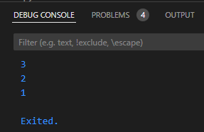
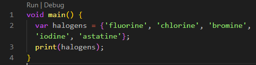
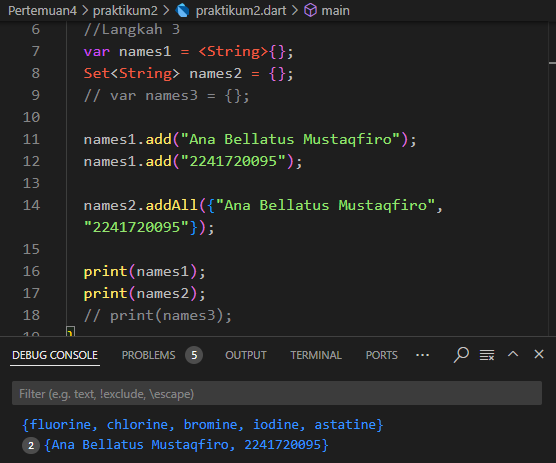
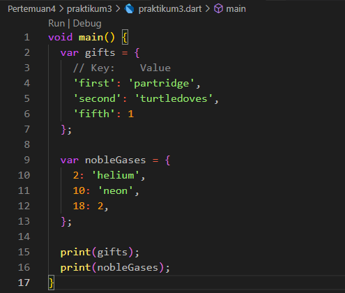
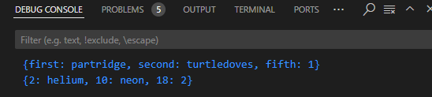
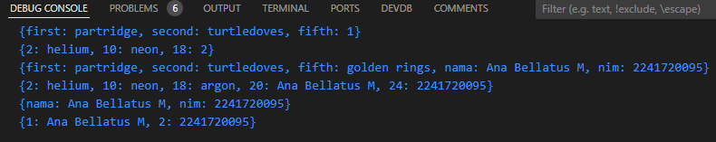
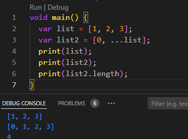
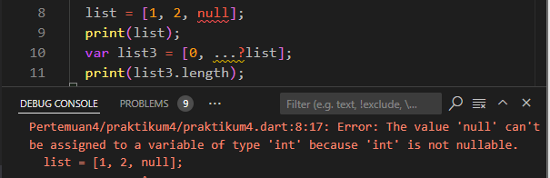

# Modul 4

---

#### NIM : 2241720095

#### Nama   : Ana Bellatus Mustaqfiro

#### Kelas   : D4 TI - 3F

#### No. Urut  : 04

#### Mata Kuliah  : Pemrograman Mobile (4 |  Pengantar Bahasa Pemrograman Dart - Bagian 3)

---

## Praktikum 1 - Eksperimen Tipe Data List

**Langkah 1**

```
void main() {
  var list = [1, 2, 3];
  assert(list.length == 3);
  assert(list[1] == 2);
  print(list.length);
  print(list[1]);

  list[1] = 1;
  assert(list[1] == 1);
  print(list[1]);
}
```

**Lankah 2**

> Kode mencetak nilai 3 (panjang list), 2(value list pada index ke 1), dan 1(value pada list index ke 1 setelah diubah nilainya)
>

**Langkah 3**


## Praktikum 2 - Eksperimen Tipe Data Set

**Langkah 1**



**Langkah 2**

> Mencetak value yang tersimpan pada set halogens
>
**Langkah 3**

> Mencetak 3 value kosong karena names1, names2, dan names3 belum diassign valuenya
> Perbaikan
> Setelah diperbaiki, kode menghasilkan output value set yang berisi nama dan nim
> 

## Praktikum 3 - Eksperimen Tipe Data Maps

**Langkah 1**


**Langkah 2**

> Mencetak value dari maps gifts dan nobleGases sesuai dengan key dan value nya

**Langkah 3**

> Dari penambahan kode yang dilakukan ialah mengubah tiap value Map menjadi string dan pada key terakhir valuenya diubah menjadi 'golden rings' untuk gifts dan 'argon' untuk nobleGases, namun tidak dicetak pada console

> Setelah dilakukan perbaikan dan ditambahkan nim dan nama pada tiap variabel
> 
> 
>

## Praktikum 4 - Eksperimen Tipe Data List: Spread dan Control-flow Operators

**Langkah 1**

> Terjadi error dikarenakan yang dipanggil ketika dicetak seharusnya list bukan list1 karena dideklarasikan dengan nama 'list'

**Langkah 2**
> Perbaikan
> Setelah diperbaiki kode tersebut digunakan untuk menambahkan value list ke dalam list2 dengan operator spread, sehingga list 2 berisi (0, 1, 2, 3)
> 

**Langkah 3**
> Terjadi error karena list tidak bisa berisi null
> 
> Perbaikan
> 

**Langkah 4**
> Terjadi error karena variabel promoActive belum dideklarasikan
> 
> Perbaikan Jika true menampilkan menu tambahan yaitu outlet
> 
> Jika false jika hanya menampilkan menu home, furniture, dan plants
> 

**Langkah 5**
> Terjadi error karena variabel login belum dideklarasikan
> 
> Perbaikan
> 
> Jika login memiliki kondisi lain
> 

**Langkah 6**

> Mencetak nilai [#0, #1, #2, #3]
> Collection For digunakan untuk membuat list dengan memanfaatkan perulangan

## Praktikum 5 - Eksperimen Tipe Data Records

**Langkah 1**


**Langkah 2**
> Terjadi error karena line 2 belum ditutup dengan semicolon(;)
> Perbaikan
> 

**Langkah 3**


**langkah 4**

> Terjadi error karena variabel mahasiswa belum di assign value
> Perbaikan
> 

**Langkah 5**

> Kode tersebut mencetak tiap value mahasiswa2 dengan mengakses posisi nya satu-satu
> Diganti dengan nama dan NIM
> 


## Tugas Praktikum

1. Silakan selesaikan Praktikum 1 sampai 5, lalu dokumentasikan berupa screenshot hasil pekerjaan Anda beserta penjelasannya!
2. Jelaskan yang dimaksud Functions dalam bahasa Dart!
   Functions adalah blok kode yang dapat dijalankan untuk melakukan tugas tertentu
3. Jelaskan jenis-jenis parameter di Functions beserta contoh sintaksnya!
   a. Named Parameters
      Parameter yang bisa dipanggil dengan nama spesifik, bukan berdasarkan posisi.
      
   b. Optional Positional Parameters
      Parameter yang sifatnya opsional. Didefinisikan dalam tanda kurung siku [].
      Contoh 
      
4. Jelaskan maksud Functions sebagai first-class objects beserta contoh sintaknya!
   Functions sebagai first-class objects maksudnya bahwa :
   a. Bisa disimpan dalam variabel
   b. Dikirim sebagai argumen ke fungsi lain
   c. Dikembalikan sebagai nilai dari fungsi lain
   Contoh
   
5. Apa itu Anonymous Functions? Jelaskan dan berikan contohnya!
   Sebuah fungsi yang namanya tidak dideklarasikan dan biasanya digunakan sebagai argumen dalam fungsi lain
   Contoh
   
6. Jelaskan perbedaan Lexical scope dan Lexical closures! Berikan contohnya!
   a. Lexical scope
      sebuah variabel hanya bisa diakses di dalam cakupan (scope) di mana variabel tersebut dideklarasikan.
      
   b. Lexical closures
      memungkinkan sebuah fungsi untuk mengingat variabel di cakupan  mana fungsi tersebut dideklarasikan, bahkan setelah scope tersebut tidak aktif lagi.
      

7. Jelaskan dengan contoh cara membuat return multiple value di Functions!
   
8. Kumpulkan berupa link commit repo GitHub pada tautan yang telah disediakan di grup Telegram!
   link repo : [Link repo](https://github.com/anabellatus/04_2241720095_pemrograman-mobile-2024/tree/main/Pertemuan4)