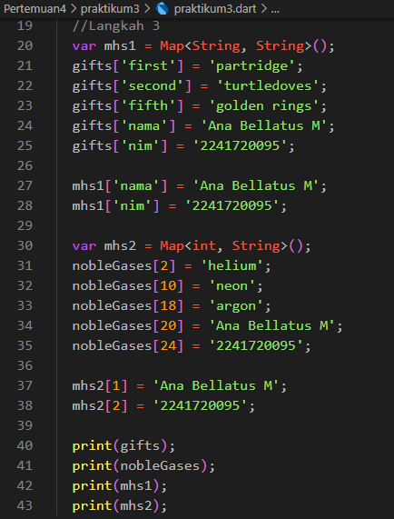

# Modul 4

---

#### NIM : 2241720095

#### Nama   : Ana Bellatus Mustaqfiro

#### Kelas   : D4 TI - 3F

#### No. Urut  : 04

#### Mata Kuliah  : Pemrograman Mobile (4 |  Pengantar Bahasa Pemrograman Dart - Bagian 3)

---

## Praktikum 1 - Eksperimen Tipe Data List

**Langkah 1**

```
void main() {
  var list = [1, 2, 3];
  assert(list.length == 3);
  assert(list[1] == 2);
  print(list.length);
  print(list[1]);

  list[1] = 1;
  assert(list[1] == 1);
  print(list[1]);
}
```

**Lankah 2**

> Kode mencetak nilai 3 (panjang list), 2(value list pada index ke 1), dan 1(value pada list index ke 1 setelah diubah nilainya)
>

**Langkah 3**


## Praktikum 2 - Eksperimen Tipe Data Set

**Langkah 1**


**Langkah 2**

> Mencetak value yang tersimpan pada set halogens
>
**Langkah 3**

> Mencetak 3 value kosong karena names1, names2, dan names3 belum diassign valuenya
> Perbaikan
> Setelah diperbaiki, kode menghasilkan output value set yang berisi nama dan nim
> 

## Praktikum 3 - Eksperimen Tipe Data Maps

**Langkah 1**


**Langkah 2**

> Mencetak value dari maps gifts dan nobleGases sesuai dengan key dan value nya

**Langkah 3**

> Dari penambahan kode yang dilakukan ialah mengubah tiap value Map menjadi string dan pada key terakhir valuenya diubah menjadi 'golden rings' untuk gifts dan 'argon' untuk nobleGases, namun tidak dicetak pada console

> Setelah dilakukan perbaikan dan ditambahkan nim dan nama pada tiap variabel
> 
> 
>

## Praktikum 4 - Eksperimen Tipe Data List: Spread dan Control-flow Operators

**Langkah 1**

> Terjadi error dikarenakan yang dipanggil ketika dicetak seharusnya list bukan list1 karena dideklarasikan dengan nama 'list'

**Langkah 2**
> Perbaikan
> Setelah diperbaiki kode tersebut digunakan untuk menambahkan value list ke dalam list2 dengan operator spread, sehingga list 2 berisi (0, 1, 2, 3)
> 

**Langkah 3**
> Terjadi error karena list tidak bisa berisi null
> 
> Perbaikan
> 