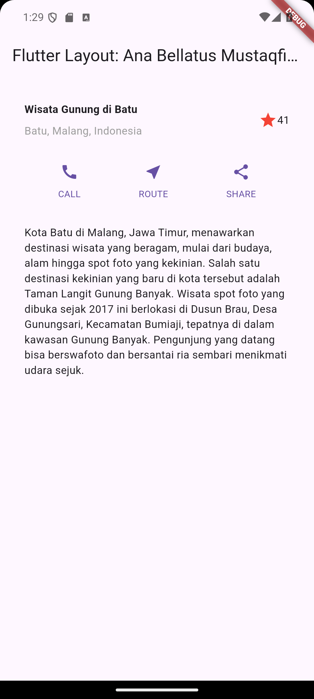
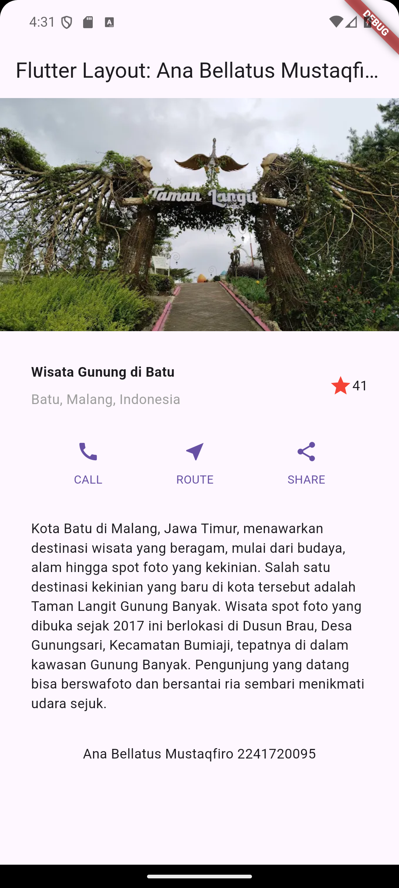

# Modul 6

---

#### NIM : 2241720095

#### Nama   : Ana Bellatus Mustaqfiro

#### Kelas   : D4 TI - 3F

#### No. Urut  : 04

#### Mata Kuliah  : Pemrograman Mobile (6 | Layout dan Navigasi)

---

## Praktikum 1 - Membangun Layout di Flutter

**Langkah 1**
Membuat project baru dengan nama layout_flutter


**Langkah 2**
Buka file lib/main.dart lalu ganti dengan kode berikut

```dart
import 'package:flutter/material.dart';

void main() {
  runApp(const MyApp());
}

class MyApp extends StatelessWidget {
  const MyApp({super.key});

  @override
  Widget build(BuildContext context) {
    return MaterialApp(
      title: 'Flutter Layout: Ana Bellatus Mustaqfiro 2241720095',
      home: Scaffold(
        appBar: AppBar(
          title: const Text('Flutter Layout: Ana Bellatus Mustaqfiro 2241720095'),
        ),
        body: const Center(
          child: Text('Hello World'),
        ),
      ),
    );
  }
}
```

**Langkah 4**
Implementasi title row

```dart
@override
  Widget build(BuildContext context) {
    Widget titleSection = Container(
      padding: const EdgeInsets.all(32),
      child: Row(
        children: [
          Expanded(
            /* soal 1*/
            child: Column(
              crossAxisAlignment: CrossAxisAlignment.start,
              children: [
                /* soal 2*/
                Container(
                  padding: const EdgeInsets.only(bottom: 8),
                  child: const Text(
                    'Wisata Gunung di Batu',
                    style: TextStyle(
                      fontWeight: FontWeight.bold,
                    ),
                  ),
                ),
                Text(
                  'Batu, Malang, Indonesia',
                  style: TextStyle(color: Colors.grey[500]),
                ),
              ],
            ),
          ),
          /* soal 3*/
          Icon(
            Icons.star,
            color: Colors.red[500],
          ),
          const Text('41'),
        ],
      ),
    );

    return MaterialApp(
      title: 'Flutter Layout: Ana Bellatus Mustaqfiro 2241720095',
      home: Scaffold(
          appBar: AppBar(
            title: const Text(
                'Flutter Layout: Ana Bellatus Mustaqfiro 2241720095'),
          ),
          body: Column(
            children: [
              titleSection,
            ],
          )),
    );
  }
```

**Hasil**


## Praktikum 2 - Implementasi Button Row

**Langkah 1**
Buat method Column _buildButtonColumn

```dart
Column _buildButtonColumn(Color color, IconData icon, String label) {
  return Column(
    mainAxisSize: MainAxisSize.min,
    mainAxisAlignment: MainAxisAlignment.center,
    children: [
      Icon(icon, color: color),
      Container(
        margin: const EdgeInsets.only(top: 8),
        child: Text(
          label,
          style: TextStyle(
            fontSize: 12,
            fontWeight: FontWeight.w400,
            color: color,
          ),
        ),
      ),
    ],
  );
}
```

**Langkah 2**
Buat widget buttonSection

```dart
@override
  Widget build(BuildContext context) {
    Color color = Theme.of(context).primaryColor;
    //...

    Widget buttonSection = Row(
      mainAxisAlignment: MainAxisAlignment.spaceEvenly,
      children: [
        _buildButtonColumn(color, Icons.call, 'CALL'),
        _buildButtonColumn(color, Icons.near_me, 'ROUTE'),
        _buildButtonColumn(color, Icons.share, 'SHARE'),
      ],
    );

    //...
  }
```

**Langkah 3**
Tambah button section ke body

```dart
@override
  Widget build(BuildContext context) {
    //...

    return MaterialApp(
      title: 'Flutter Layout: Ana Bellatus Mustaqfiro 2241720095',
      home: Scaffold(
          appBar: AppBar(
            title: const Text(
                'Flutter Layout: Ana Bellatus Mustaqfiro 2241720095'),
          ),
          body: Column(
            children: [
              titleSection,
              buttonSection,
            ],
          )),
    );
  }
```

**Hasil**


## Praktikum 3 - Implementasi text section

**Langkah 1**
Buat widget textsection

```dart
@override
  Widget build(BuildContext context) {
    //...
    Widget textSection = Container(
      padding: const EdgeInsets.all(32),
      child: const Text(
        'Kota Batu di Malang, Jawa Timur, menawarkan destinasi wisata yang beragam, mulai dari budaya, alam hingga spot foto yang kekinian. Salah satu destinasi kekinian yang baru di kota tersebut adalah Taman Langit Gunung Banyak. Wisata spot foto yang dibuka sejak 2017 ini berlokasi di Dusun Brau, Desa Gunungsari, Kecamatan Bumiaji, tepatnya di dalam kawasan Gunung Banyak. Pengunjung yang datang bisa berswafoto dan bersantai ria sembari menikmati udara sejuk.',
        softWrap: true,
      ),
    );
    //...
  }
```

**Langkah 2**
Tambahkan variabel tex section ke body

```dart
@override
  Widget build(BuildContext context) {
    //...

    return MaterialApp(
      title: 'Flutter Layout: Ana Bellatus Mustaqfiro 2241720095',
      home: Scaffold(
          appBar: AppBar(
            title: const Text(
                'Flutter Layout: Ana Bellatus Mustaqfiro 2241720095'),
          ),
          body: Column(
            children: [
              titleSection,
              buttonSection,
              textSection,
            ],
          )),
    );
  }
```



## Praktikum 4 - Implementasi image section

**Langkah 1**
Siapkan asset gambar


**Langkah 2**
Tambahkan gambar ke body

```dart
return MaterialApp(
      title: 'Flutter Layout: Ana Bellatus Mustaqfiro 2241720095',
      home: Scaffold(
          appBar: AppBar(
            title: const Text(
                'Flutter Layout: Ana Bellatus Mustaqfiro 2241720095'),
          ),
          body: Column(
            children: [
              Image.asset(
                'images/taman-langit.png',
                width: 600,
                height: 240,
                fit: BoxFit.cover,
              ),
              titleSection,
              buttonSection,
              textSection,
            ],
          )),
    );
```

**Langkah 3**
ubah menjadi Listview

```dart
return MaterialApp(
      title: 'Flutter Layout: Ana Bellatus Mustaqfiro 2241720095',
      home: Scaffold(
          appBar: AppBar(
            title: const Text(
                'Flutter Layout: Ana Bellatus Mustaqfiro 2241720095'),
          ),
          body: ListView(
            children: [
              Image.asset(
                'images/taman-langit.png',
                width: 600,
                height: 240,
                fit: BoxFit.cover,
              ),
              titleSection,
              buttonSection,
              textSection,
            ],
          )),
    );
```



## Praktikum 5 - Membangun navigasi di flutter

**Langkah 1**
Siapkan project baru


**Langkah 2**
Mendefinisikan route

**home_page.dart**

```dart
class HomePage extends StatelessWidget {
  HomePage({super.key});

  @override
  Widget build(BuildContext context) {
    throw UnimplementedError();
  }
}
```

item_page.dart
```dart
class ItemPage extends StatelessWidget {
  ItemPage({super.key});

  @override
  Widget build(BuildContext context) {
    throw UnimplementedError();
  }
}
```

**Langkah 3**
Lengkapi kode di main.dart

**main.dart**

```dart
void main() {
  runApp(MaterialApp(
    initialRoute: '/',
    routes: {
      '/': (context) => HomePage(),
      '/item': (context) => ItemPage(),
    },
  ));
}
```

**Langkah 4**
Membuat data model

**./lib/models/item.dart**

```dart
class Item {
  String name;
  int price;

  Item({required this.name, required this.price});  
}
```

**Langkah 5**
Lengkapi kode di class HomePage

```dart
class HomePage extends StatelessWidget {
  HomePage({super.key});

  final List<Item> items = [
    Item(name: 'Sugar', price: 5000),
    Item(name: 'Salt', price: 2000),
  ];

  //...
}
```

**Langkah 6**
Membuat Listview dan Itembuilder

**home_page.dart**

```dart
@override
  Widget build(BuildContext context) {
    return Scaffold(
        appBar: AppBar(
          title: const Text('Home Page'),
        ),
        body: Container(
          margin: const EdgeInsets.all(8),
          child: ListView.builder(
            padding: const EdgeInsets.all(8),
            itemCount: items.length,
            itemBuilder: (context, index) {
              final item = items[index];
              return Card(
                  child: Container(
                margin: const EdgeInsets.all(8),
                child: Row(
                  children: [
                    Expanded(child: Text(item.name)),
                    Expanded(
                        child: Text(
                      item.price.toString(),
                      textAlign: TextAlign.end,
                    )),
                  ],
                ),
              ));
            },
          ),
        ));
    }
```

**Setelah dijalankan pada emulator**


**Langkah 7**
Menambahkan aksi pada listview

```dart
return InkWell(
                onTap: () {
                  Navigator.pushNamed(context, '/item');
                },
                child: Card(
                    child: Container(
                  margin: const EdgeInsets.all(8),
                  child: Row(
                    children: [
                      Expanded(child: Text(item.name)),
                      Expanded(
                          child: Text(
                        item.price.toString(),
                        textAlign: TextAlign.end,
                      )),
                    ],
                  ),
                )),
              );
```

Hasil


## Tugas Praktikum 1

```dart
import 'package:flutter/material.dart';

void main() {
  runApp(const MyApp());
}

class MyApp extends StatelessWidget {
  const MyApp({super.key});

  @override
  Widget build(BuildContext context) {
    return MaterialApp(
      title: 'Pavlova',
      theme: ThemeData(
        colorScheme: ColorScheme.fromSeed(seedColor: Colors.deepPurple),
        useMaterial3: true,
      ),
      home: const MyHomePage(
        title: 'Strawberry Pavlova Recipe - Ana Bellatus M',
      ),
    );
  }
}

class MyHomePage extends StatelessWidget {
  const MyHomePage({super.key, required this.title});

  final String title;

  @override
  Widget build(BuildContext context) {
    const titleText = Padding(
      padding: EdgeInsets.all(20),
      child: Text(
        'Strawberry Pavlova',
        style: TextStyle(
          fontWeight: FontWeight.w800,
          letterSpacing: 0.5,
          fontSize: 30,
        ),
      ),
    );

    const subTitle = Text(
      'Pavlova is a meringue-based dessert named after the Russian ballerina '
      'Anna Pavlova. Pavlova features a crisp crust and soft, light inside, '
      'topped with fruit and whipped cream.',
      textAlign: TextAlign.center,
      style: TextStyle(
        fontFamily: 'Georgia',
        fontSize: 25,
      ),
    );

    final stars = Row(
      mainAxisSize: MainAxisSize.min,
      children: [
        Icon(Icons.star, color: Colors.green[500]),
        Icon(Icons.star, color: Colors.green[500]),
        Icon(Icons.star, color: Colors.green[500]),
        Icon(Icons.star, color: Colors.green[500]),
        const Icon(Icons.star, color: Colors.black),
      ],
    );

    final ratings = Container(
      padding: const EdgeInsets.all(20),
      child: Row(
        mainAxisAlignment: MainAxisAlignment.spaceEvenly,
        children: [
          stars,
          const Text(
            '170 Reviews',
            style: TextStyle(
              color: Colors.black,
              fontWeight: FontWeight.w800,
              fontFamily: 'Roboto',
              letterSpacing: 0.5,
              fontSize: 20,
            ),
          ),
        ],
      ),
    );

    const descTextStyle = TextStyle(
      color: Colors.black,
      fontWeight: FontWeight.w800,
      fontFamily: 'Roboto',
      letterSpacing: 0.5,
      fontSize: 18,
      height: 2,
    );

    final iconList = DefaultTextStyle.merge(
      style: descTextStyle,
      child: Container(
        padding: const EdgeInsets.all(20),
        child: Row(
          mainAxisAlignment: MainAxisAlignment.spaceEvenly,
          children: [
            Column(
              children: [
                Icon(Icons.kitchen, color: Colors.green[500]),
                const Text('PREP:'),
                const Text('25 min'),
              ],
            ),
            Column(
              children: [
                Icon(Icons.timer, color: Colors.green[500]),
                const Text('COOK:'),
                const Text('1 hr'),
              ],
            ),
            Column(
              children: [
                Icon(Icons.restaurant, color: Colors.green[500]),
                const Text('FEEDS:'),
                const Text('4-6'),
              ],
            ),
          ],
        ),
      ),
    );

    final leftColumn = Container(
      padding: const EdgeInsets.fromLTRB(20, 30, 20, 20),
      child: Column(
        children: [
          titleText,
          subTitle,
          ratings,
          iconList,
        ],
      ),
    );

    final mainImage = Image.asset(
      'images/pavlova.jpg',
      fit: BoxFit.cover,
    );

    return MaterialApp(
      home: Scaffold(
        appBar: AppBar(
          title: Text(title),
        ),
        body: Center(
          child: Container(
            margin: const EdgeInsets.fromLTRB(0, 40, 0, 30),
            height: 600,
            child: Card(
              child: Row(
                crossAxisAlignment: CrossAxisAlignment.start,
                children: [
                  SizedBox(
                    width: 440,
                    child: leftColumn,
                  ),
                  mainImage,
                ],
              ),
            ),
          ),
        ),
      ),
    );
  }
}
```


## Tugas Praktikum 2

1. Memperbarui kode pada bagian navigator untu pengiriman data ke halaman berikutnya

```dart
onTap: () 
  {
    Navigator.pushNamed(context, '/item', arguments: item);
  },
```

2. Membaca data pada halaman ItemPage

```dart
Widget build(BuildContext context) {

    final itemArgs = ModalRoute.of(context)!.settings.arguments as Item;

    return Scaffold(
      appBar: AppBar(
        title: const Text('Item Page - Ana B.M 2241720095'),
      ),
      body: Center(
        child: Column(
          children: [
            Text(itemArgs.name),
            Text(itemArgs.price.toString()),
          ],
        ),
      ),
    );
  }
```


3. Menambahkan atribut foto produk, stok, dan rating, serta mengubah tampilan menjaadi GridView

**item.dart**

```dart
class Item {
  String name;
  int stock;
  int price;
  int rating;

  Item({
    required this.name,
    required this.stock,
    required this.price,
    required this.rating,
  });
}
```

**pubspec.yaml**

```dart
assets:
    - images/rice.jpg
    - images/sugar.jpg
    - images/egg.jpg
    - images/salt.jpg
```

**homepage.dart**

```dart
class HomePage extends StatelessWidget {
  HomePage({super.key});

  final List<Item> items = [
    Item(name: 'Sugar', stock: 20, price: 5000, rating: 4),
    Item(name: 'Salt', stock: 30, price: 2000, rating: 3),
    Item(name: 'Rice', stock: 10, price: 8000, rating: 5),
    Item(name: 'Egg', stock: 40, price: 20000, rating: 4),
  ];

  @override
  Widget build(BuildContext context) {
    return Scaffold(
        appBar: AppBar(
          title: const Text('Home Page - Ana B.M 2241720095'),
        ),
        body: Container(
          margin: const EdgeInsets.all(8),
          child: GridView.count(
            crossAxisCount: 2,
            children: List.generate(items.length, (index) {
              final Item item = items[index];
              return InkWell(
                onTap: () {
                  Navigator.pushNamed(context, '/item', arguments: item);
                },
                child: Card(
                  child: Container(
                    margin: const EdgeInsets.all(8),
                    child: Column(
                      crossAxisAlignment: CrossAxisAlignment.center,
                      children: [
                        Center(
                          child: Image.asset(
                            'images/${item.name.toLowerCase()}.jpg',
                            height: 100,
                            fit: BoxFit.cover,
                          ),
                        ),
                        Text(item.name,
                            style: const TextStyle(
                              fontSize: 18,
                              fontWeight: FontWeight.bold,
                            )),
                        Text(
                          'Rp. ${item.price},-',
                          style: const TextStyle(
                            fontSize: 16,
                            fontWeight: FontWeight.bold,
                          ),
                        ),
                        Row(
                          mainAxisAlignment: MainAxisAlignment.spaceEvenly,
                          children: [
                            Text('Stock: ${item.stock}'),
                            Row(
                              children: [
                                const Icon(
                                  Icons.star,
                                  color: Colors.yellow,
                                ),
                                Text(item.rating.toString()),
                              ],
                            ),
                          ],
                        ),
                      ],
                    ),
                  ),
                ),
              );
            }),
          ),
        ));
  }
}
```

Output


4. Mengimplementasikan Hero Widget 
   **home_page.dart**

```dart
   //...
   Center(
    child: Hero(
    tag: item.name,
    child: Image.asset(
      'images/${item.name.toLowerCase()}.png',
      height: 100,
      fit: BoxFit.cover,
        ),
      ),
    ),
    //...
```

**item_page.dart**

```dart
Center(
  child: Hero(
    tag: itemArgs.name,
    child: Image.asset(
      'images/${itemArgs.name.toLowerCase()}.png',
      height: 300,
      fit: BoxFit.cover,
    ),
  ),
),
```

Hasil


5. Modifikasi tampilan dan memecah widget menjadi kode yang lebih kecil

**home_page.dart**

```dart
import 'package:belanja/models/item.dart';
import 'package:flutter/material.dart';

class HomePage extends StatelessWidget {
  HomePage({super.key});

  final List<Item> items = [
    Item(
        name: 'Sugar',
        stock: 20,
        price: 5000,
        rating: 4,
        desc:
            'Sugar is a sweet food that is made from sugar cane or sugar beet. Sugar is used to sweeten food and drinks. It is also used in making cakes and sweets.'),
    Item(
        name: 'Salt',
        stock: 30,
        price: 2000,
        rating: 3,
        desc:
            'Salt is a mineral that is composed primarily of sodium chloride, a chemical compound belonging to the larger class of salts; salt in its natural form as a crystalline mineral is known as rock salt or halite.'),
    Item(
        name: 'Rice',
        stock: 10,
        price: 8000,
        rating: 5,
        desc:
            'Rice is the seed of the grass species Oryza sativa (Asian rice) or less commonly Oryza glaberrima (African rice). As a cereal grain, it is the most widely consumed staple food for a large part of the world\'s human population, especially in Asia.'),
    Item(
        name: 'Egg',
        stock: 40,
        price: 20000,
        rating: 4,
        desc:
            'An egg is the organic vessel containing the zygote in which an embryo develops until it can survive on its own, at which point the animal hatches.'),
  ];

  @override
  Widget build(BuildContext context) {
    return Scaffold(
        appBar: AppBar(
          title: const Text('Home Page - Ana B.M 2241720095'),
        ),
        body: Container(
          margin: const EdgeInsets.all(8),
          child: GridView.count(
            crossAxisCount: 2,
            children: List.generate(items.length, (index) {
              final Item item = items[index];
              return Column(
                children: [
                  ItemCard(item: item),
                ],
              );
            }),
          ),
        ));
  }
}

class ItemCard extends StatelessWidget {
  final Item item;

  const ItemCard({super.key, required this.item});

  @override
  Widget build(BuildContext context) {
    final heroImage = Hero(
      tag: item.name,
      child: Image.asset(
        'images/${item.name.toLowerCase()}.png',
        height: 100,
        fit: BoxFit.cover,
      ),
    );

    final itemName = Text(
      item.name,
      style: const TextStyle(
        fontSize: 18,
        fontWeight: FontWeight.bold,
      ),
    );

    final itemPrice = Text(
      'Rp. ${item.price},-',
      style: const TextStyle(
        fontSize: 14,
        fontWeight: FontWeight.bold,
      ),
    );

    final stockInfo = Text('Stock: ${item.stock}');

    final ratingRow = Row(
      children: [
        const Icon(
          Icons.star,
          color: Colors.yellow,
        ),
        Text(item.rating.toString()),
      ],
    );

    final bottomRow = Row(
      mainAxisAlignment: MainAxisAlignment.spaceEvenly,
      children: [
        stockInfo,
        ratingRow,
      ],
    );

    return InkWell(
      onTap: () {
        Navigator.pushNamed(context, '/item', arguments: item);
      },
      child: Card(
        child: Container(
          margin: const EdgeInsets.all(8),
          child: Column(
            crossAxisAlignment: CrossAxisAlignment.center,
            children: [
              Center(child: heroImage),
              itemName,
              itemPrice,
              bottomRow,
            ],
          ),
        ),
      ),
    );
  }
}
```

**item_page.dart**

```dart
import 'package:belanja/models/item.dart';
import 'package:flutter/material.dart';

class ItemPage extends StatelessWidget {
  const ItemPage({super.key});

  @override
  Widget build(BuildContext context) {
    final itemArgs = ModalRoute.of(context)!.settings.arguments as Item;

    final heroImage = Center(
      child: Hero(
        tag: itemArgs.name,
        child: Image.asset(
          'images/${itemArgs.name.toLowerCase()}.png',
          height: 300,
          fit: BoxFit.cover,
        ),
      ),
    );

    final itemName = Text(
      itemArgs.name,
      style: const TextStyle(
        fontSize: 24,
        fontWeight: FontWeight.bold,
      ),
    );

    final itemPrice = Padding(
      padding: const EdgeInsets.symmetric(vertical: 10),
      child: Text(
        'Rp. ${itemArgs.price},-',
        style: const TextStyle(
          fontSize: 16,
          color: Colors.green,
          fontWeight: FontWeight.bold,
        ),
      ),
    );

    final itemStock = Text('Stock: ${itemArgs.stock}');

    final itemRating = Padding(
      padding: const EdgeInsets.all(14.0),
      child: Row(
        children: [
          const Icon(
            Icons.star,
            color: Colors.yellow,
          ),
          Text(itemArgs.rating.toString()),
        ],
      ),
    );

    final itemDescription = Text(itemArgs.desc);

    const footer = Padding(
      padding: EdgeInsets.all(38.0),
      child: Center(
        child: Column(
          children: [
            Text('Ana Bellatus Mustaqfiro'),
            Text('2241720095'),
          ],
        ),
      ),
    );

    return Scaffold(
      appBar: AppBar(
        title: const Text('Item Page - Ana B.M 2241720095'),
      ),
      body: Padding(
        padding: const EdgeInsets.all(24.0),
        child: Column(
          crossAxisAlignment: CrossAxisAlignment.start,
          children: [
            heroImage,
            itemName,
            itemPrice,
            itemStock,
            itemRating,
            itemDescription,
            footer,
          ],
        ),
      ),
    );
  }
}
```

**item.dart**

```dart
class Item {
  String name;
  int stock;
  int price;
  int rating;
  String desc;

  Item({
    required this.name,
    required this.stock,
    required this.price,
    required this.rating,
    required this.desc,
  });
}
```

Hasil


6. Modifikasi menggunakan plugin go_router


dependenciesnya otomatis akan ditambahkan pada pubspec.yaml

```dart
dependencies:
  flutter:
    //...
  go_router: ^14.3.0
```

**main.dart**

```dart
void main() {
  runApp(MaterialApp.router(
    routerConfig: _router,
  ));
}

final GoRouter _router = GoRouter(
  routes: <RouteBase>[
    GoRoute(
      path: '/',
      builder: (BuildContext context, GoRouterState state) {
        return HomePage();
      },
      routes: <RouteBase>[
        GoRoute(
          path: '/item',
          builder: (BuildContext context, GoRouterState state) {
            return const ItemPage();
          },
        ),
      ],
    ),
  ],
);
```

**home_page.dart**

```dart
//...
return InkWell(
  onTap: () {
    GoRouter.of(context).go('/item', extra: item);
    },
)
//...
```

**item_page.dart**

```dart
class ItemPage extends StatelessWidget {
  const ItemPage({super.key});

  @override
  Widget build(BuildContext context) {
    final itemArgs = GoRouterState.of(context).extra as Item;

    //...
  }
}
```

