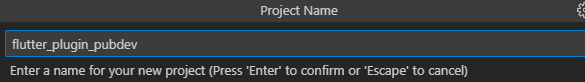
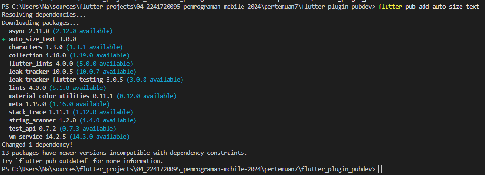
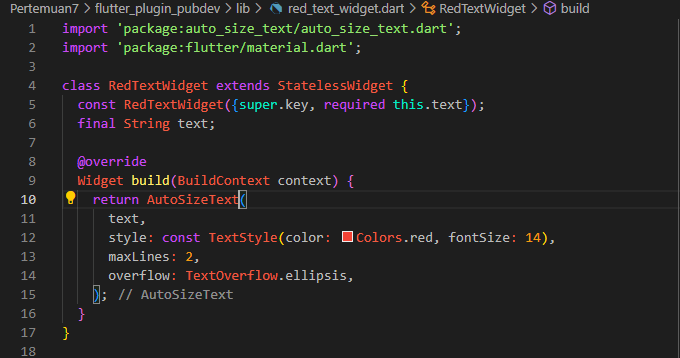
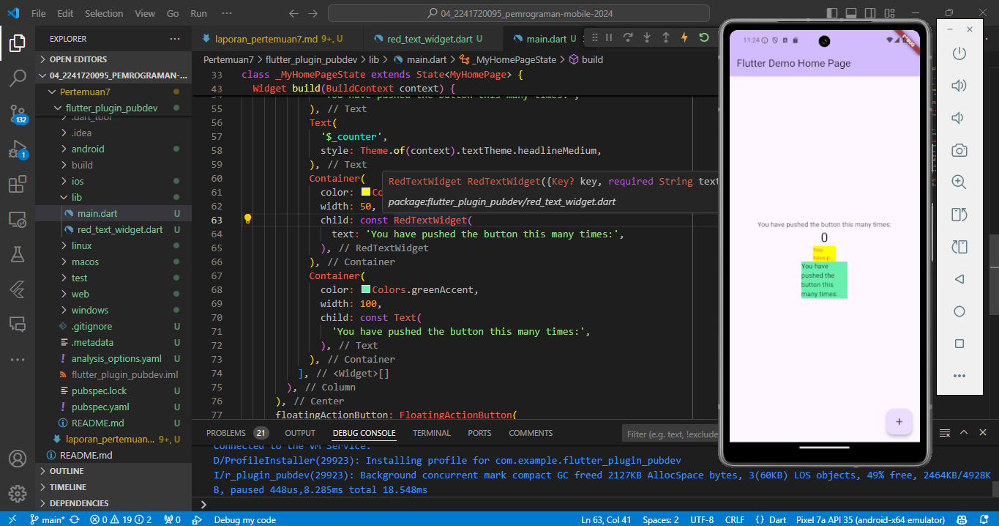

# Modul 7

---

#### NIM : 2241720095

#### Nama   : Ana Bellatus Mustaqfiro

#### Kelas   : D4 TI - 3F

#### No. Urut  : 04

#### Mata Kuliah  : Pemrograman Mobile (7 | Manajemen Plugin)

---

## Praktikum 1 - Menerapkan Plugin di  Project Flutter

**Langkah 1 - Buat project baru**


**Langkah 2 - Menambahkan Plugin**


**Langkah 3 - Buat file red_text_widget.dart**

**red_text_widget.dart**
```dart
import 'package:flutter/material.dart';

class RedTextWidget extends StatelessWidget {
  const RedTextWidget({Key? key}) : super(key: key);

  @override
  Widget build(BuildContext context) {
    return Container();
  }
}
```

**Langkah 4 - Tambah Widget AutoSizeText**

**red_text_widget.dart**
```dart
class RedTextWidget extends StatelessWidget {
  const RedTextWidget({Key? key}) : super(key: key);

  @override
  Widget build(BuildContext context) {
    return AutoSizeText(
      text,
      style: const TextStyle(color: Colors.red, fontSize: 14),
      maxLines: 2,
      overflow: TextOverflow.ellipsis,
    );
  }
}
```
> Error tersebut terjadi karena Widget AutoSizeText belum diimport package nya
> Perbaikan
> 

**Langkah 5 - Buat Variabel text dan parameter di constructor**

```dart
class RedTextWidget extends StatelessWidget {
  const RedTextWidget({super.key, required this.text});
  final String text;

  //...
  }
```

**Langkah 6 - Tambahkan widget di main.dart**

**main.dart**
```dart
Container(
   color: Colors.yellowAccent,
   width: 50,
   child: const RedTextWidget(
             text: 'You have pushed the button this many times:',
          ),
),
Container(
    color: Colors.greenAccent,
    width: 100,
    child: const Text(
           'You have pushed the button this many times:',
          ),
),
```

Hasil


## Tugas Praktikum

1. Selesaikan Praktikum tersebut, lalu dokumentasikan dan push ke repository Anda berupa screenshot hasil pekerjaan beserta penjelasannya di file README.md!
2. Jelaskan maksud dari langkah 2 pada praktikum tersebut!

3. Jelaskan maksud dari langkah 5 pada praktikum tersebut!
4. Pada langkah 6 terdapat dua widget yang ditambahkan, jelaskan fungsi dan perbedaannya!
5. Jelaskan maksud dari tiap parameter yang ada di dalam plugin auto_size_text berdasarkan tautan pada dokumentasi ini !
6. Kumpulkan laporan praktikum Anda berupa link repository GitHub kepada dosen!